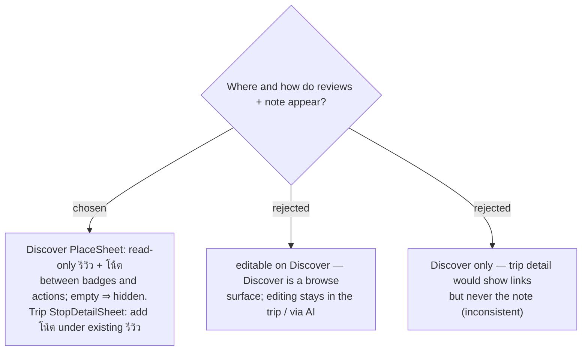

# ADR-104: Read-only "รีวิว" + "โน้ต" sections on the Discover `PlaceSheet`; a "โน้ต" section added to the trip `StopDetailSheet`

**Date:** 2026-07-20
**Status:** Accepted (Phase 1)
**Issue:** [#44](https://github.com/ThodsaphonSonthiphin/MenuNest/issues/44)
**Confirmed mock:** MenuNest design system → Screens → `issue-44-discover-review-note` (claude.ai/design, project `8d8d4c81`).
**Relates to:** ADR-052 (review affordance on the Stop card); `StopDetailSheet` already renders a "รีวิว" section; ADR-097 (Discover is a browse surface).

## Context

Discover is a map-forward **browse** surface (ADR-097); the issue asks to *show* (แสดง) the links
and note. The trip `StopDetailSheet` already shows a "รีวิว" section but never the note.

## Decision

- **Discover `PlaceSheet`:** add a **read-only** "รีวิว" section (each link an `<a target="_blank"
  rel="noopener noreferrer">` opening in a new tab, reusing `ReviewIcon` + `reviewLabel`/`reviewHost`)
  and a **read-only** "โน้ต" section (free-text block), placed **between the badges and the action
  buttons**, per the confirmed mock. Each section is **hidden entirely when empty** — a place with
  no links/note looks exactly as today. No editing on Discover.
- **Trip `StopDetailSheet`:** add a "โน้ต" section (from `TripPlaceDto.notes`, already present)
  **below** its existing "รีวิว" section, so the note is visible where the place lives too.

## Consequences

**Positive:** matches the confirmed mock; reuses shipped review components and CSS tokens
(`--review`); no editing surface to build on Discover. **Negative:** editing the note remains
via AI/MCP `update_trip_place` only (no manual web input) — a deliberate Phase-1 scope cut
(manual note editing in the place editor is deferred).
