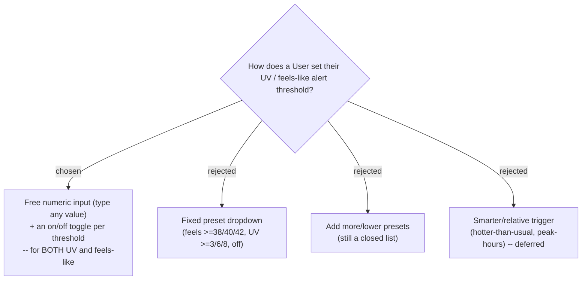

# ADR-105: Weather-alert thresholds are free numeric inputs with an on/off toggle

**Date:** 2026-07-20
**Status:** Accepted (owner chose free numeric entry over fixed presets)
**Relates to:** issue #40; ADR-086 (UV + feels-like scope), ADR-089 (two per-User configurable thresholds), ADR-090 (`/settings` page), ADR-091 (tri-state storage `null`/`0`/`N`); the **Weather alert** / **Weather-alert threshold** glossary terms (CONTEXT.md).
**Supersedes:** the fixed **preset-dropdown** threshold control introduced by the #40 design spec (`weatherAlertOptions.ts` `UV_ALERT_OPTIONS` / `FEELS_ALERT_OPTIONS` + the two `DropDownList`s on `SettingsPage.tsx`).

## Context

The **UV index** alert is naturally silent in the evening -- UV drops to 0-1 in the last hour or two before sunset even under a clear ("แดดจัด") sky (physics; verified live against the Google Weather API: Rayong UV peaks 9 at midday, 1 at 17:00, 0 by 18:00). The **Feels-like** alert exists for exactly the owner's scenario (ADR-086: "is it too hot to take my daughter out in the evening"), but its lowest preset (`>=38`) sits above the owner's real discomfort point (~36), so it never fires -- the stop that prompted this shows feels-like 36 with no warning.

The owner's steer: *don't hand users a fixed set of options -- let them type the number they actually care about.* The floor problem is a symptom of the closed preset list, not of the threshold model itself.

The backend already supports any value end-to-end: `UpdateUserSettingsValidator` accepts `UvWarnThreshold` 0..15 and `FeelsLikeWarnThreshold` 0..60, and `UserSettings` stores each as `int?` with the tri-state encoding `null` = built-in default (UV 6 / feels 40), `0` = off, `N` = warn at `>= N` (ADR-091). Only the **frontend** control locks users into presets.

## Decision

Replace both preset `DropDownList`s on `/settings` -> "เตือนอากาศ" with a **free numeric input plus an on/off toggle**, applied to **both** the UV and the feels-like threshold (kept consistent -- not just the heat one):

- **Toggle off** -> the threshold is disabled; persists `0` (the existing "off" encoding). The number field is disabled/greyed but retains its value in component state so toggling back on restores it.
- **Toggle on** -> warn when the on-arrival reading reaches the typed value; persists that integer `N`.
- **Never touched** (`null` in storage) -> toggle shown **on**, field pre-filled with the built-in default (UV 6 / feels 40).
- **Bounds** mirror the server: feels-like `0-60`, UV `0-15`, integers; clamp on the client so a stored value can never fail server validation.
- **Save trigger** changes from dropdown-select to **on blur / Enter** (not per keystroke), keeping the existing full-snapshot auto-save + "บันทึกแล้ว" affordance and the `isLoadingProfile` data-loss guard.

No backend, DTO, command, entity, migration, or storage change -- the tri-state contract (ADR-091) is unchanged. This is a **frontend-only** control redesign.

The alert's *placement and semantics are untouched*: it remains the On-arrival, compact-itinerary-card badge (ADR-092), display-only, never feeding the Smart Schedule.

## Consequences

**Positive:** the owner can set their own discomfort point (e.g. feels-like 35) so the warning fires when it matters; noise-vs-signal becomes the User's own explicit trade-off, not a designer-imposed floor; zero backend work and no migration. Consistent UV + feels-like controls.

**Negative:** loses the friendly WHO-band labels the UV dropdown carried ("ปานกลางขึ้นไป (>=3)") -- mitigated by the UV-band colour/word still shown on the reading itself (ADR-088) and an optional inline hint. A free number invites unhelpful values (e.g. feels-like 5, warns on almost everything) -- mitigated by client clamping and a suggested-range hint, but ultimately the User's choice. `weatherAlertOptions.ts` preset lists are removed/retired and `SettingsPage` gains numeric-input + toggle wiring and the blur-save change.