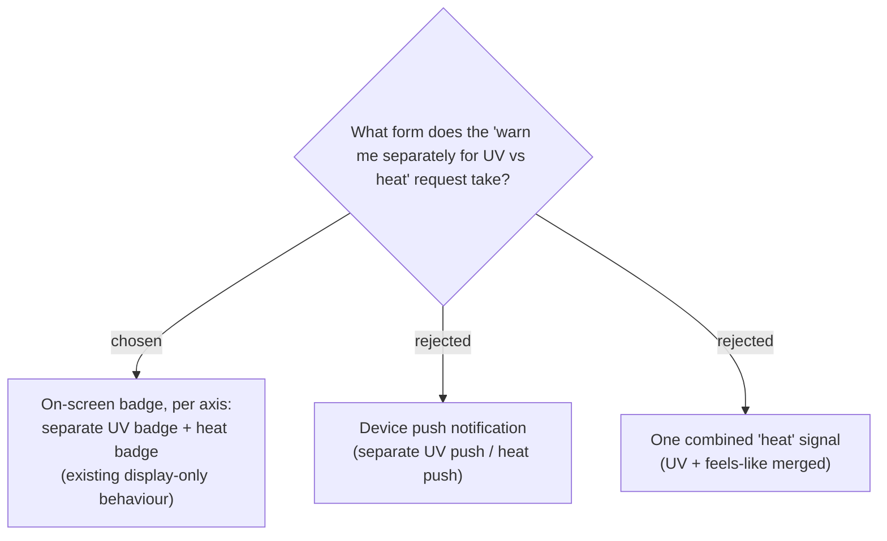

# ADR-106: Weather alert stays an on-screen display badge (push deferred); UV and heat warn as separate badges

**Date:** 2026-07-20
**Status:** Accepted (owner chose on-screen badge over device push)
**Relates to:** issue #40; ADR-087 / ADR-092 (On-arrival, compact-card, display-only alert badge), ADR-105 (numeric-input thresholds); the **Weather alert** glossary term (CONTEXT.md: *"Display-only -- it never feeds the Smart Schedule or any computed value"*); the existing web-push infra in the Health module (`WebPushSender`, `Push`/VAPID config).

## Context

The owner asked that the warning "เตือนแยกกัน -- UV ส่วน UV, ความร้อนส่วนความร้อน" (warn separately: UV as UV, heat as heat). On clarifying the word "notification", the owner confirmed they mean the **on-screen warning badge** (option ก), **not** a device push notification (option ข).

The system already satisfies "separate": `weatherAlertBadges` returns `{ uv?, feels? }` independently and the compact card renders two distinct badges; ADR-105 keeps two independent thresholds + toggles. The existing **Weather alert** is display-only by definition (CONTEXT.md).

Device push is *technically* reachable (the Health module already ships web-push via `WebPushSender` + VAPID), but wiring weather push would need a background service that periodically re-evaluates upcoming stops' forecasts against each User's thresholds, plus scheduling, permission prompts, and de-duplication -- a substantial new feature well beyond #40's "let the User set the threshold" scope.

## Decision

The weather warning stays the **existing on-arrival, compact-itinerary-card, display-only badge** (ADR-087, ADR-092), rendered as **two independent badges** -- one for UV, one for feels-like/heat -- never merged into a single composite signal (consistent with ADR-086's rejection of a composite score).

**Real device push notifications for weather are explicitly deferred** to a future, separately-grilled feature/issue; they are out of scope here.

**Placement is unchanged for this change**: the badge appears on the itinerary card, not on the Stop **detail sheet** (the sheet still shows the raw "รู้สึก N°" / UV value without warning styling). Adding threshold-aware highlighting to the detail sheet is noted as an optional, cleanly-separable follow-up if the owner wants it later.

## Consequences

**Positive:** the "แยกกัน" requirement is met with zero new infrastructure; ships as a frontend-only change alongside ADR-105; no background jobs, no push-permission UX, no new cost. **Negative:** the heat/UV warning is only seen while the owner is browsing the itinerary card in-app -- it is not proactively pushed, so it can't warn them when the app is closed. If proactive push is wanted later, it is a distinct, larger feature (background forecast evaluation + push fan-out) to be grilled on its own.