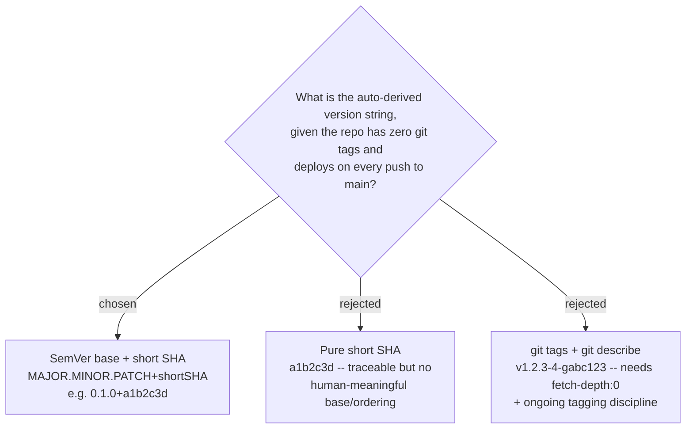

# ADR-107: App version = SemVer base + short git SHA (SemVer-2.0 build metadata)

**Date:** 2026-07-20
**Status:** Accepted (owner chose Option B -- semver base + auto SHA -- over pure SHA and over git tags)
**Relates to:** issue #41 ("add version to api and front end, try to use auto version with git"); the CD pipelines (`main_menunest.yml` backend -> App Service, `azure-static-web-apps-green-rock-098e70e00.yml` frontend -> Static Web App); the **App version** glossary term (CONTEXT.md).

## Context

Issue #41 asks that both the API and the SPA report a version, "auto version with git". Two facts about the repo shape the choice: it has **zero git tags**, and it **deploys on every push to `main`** (continuous deployment -- there are no discrete, human-cut releases). "Industry standard" therefore splits by shape: tag-based `git describe` is the standard for *released* products, whereas for a continuously-deployed app the modern norm is that the **commit SHA is the source of truth for what is deployed**, optionally decorated with a semver. SemVer 2.0 reserves the `+build` suffix for exactly this.

## Decision

The version string is a **SemVer-2.0** value: a `MAJOR.MINOR.PATCH` base plus a `+<shortSha>` build-metadata suffix -- e.g. `0.1.0+a1b2c3d`.

- The **base** (`0.1.0` to start) lives in one source-controlled place per side (`package.json` `"version"` already exists on the frontend; the backend gets a matching `<Version>` property). It is bumped **by hand**, only when the owner decides a release is meaningful.
- The **short SHA** is **auto-injected from git** and carries the real day-to-day "which commit is live" identity. It is sourced from the CI git context (`github.sha`) so **no git tags and no full clone are needed** -- this deliberately sidesteps the shallow-clone (`fetch-depth: 1`) trap in both pipelines. Local builds fall back to `git rev-parse HEAD (first 7 chars)`.

Rejected: **pure SHA** (traceable but communicates no release intent or ordering to a human) and **git tags / `git describe`** (the purest standard, but requires `fetch-depth: 0` in CI plus tagging discipline a solo CD project rarely sustains; stale tags then make `git describe` report misleading distances).

## Consequences

**Positive:** a spec-valid semantic version today; the auto part stays genuinely automatic; no tagging discipline, no deep clone, no new cost; upgrades cleanly to full tag-based `git describe` later without changing the display or API contract. **Negative:** the base number is hand-maintained, so it can go stale if the owner forgets to bump it -- accepted, because the short SHA always carries the true identity of what is deployed regardless of the base.