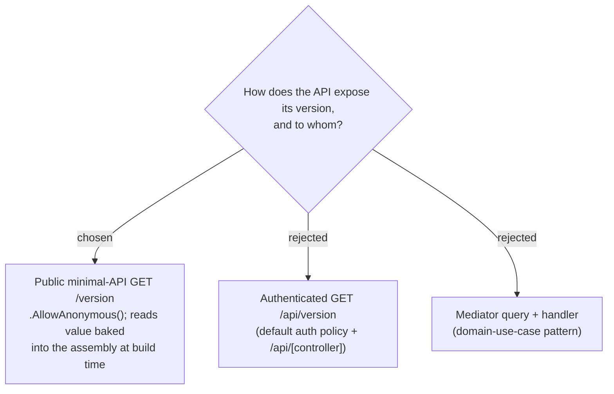

# ADR-108: API exposes version via a public minimal-API `GET /version` (not a Mediator use case)

**Date:** 2026-07-20
**Status:** Accepted (owner chose public `/version` over an authenticated `/api/version`)
**Relates to:** issue #41; ADR-107 (version format); `Program.cs` default `FallbackPolicy = RequireAuthenticatedUser`; the thin-controller-over-`IMediator` convention (`MeController`, etc.).



## Context

Every endpoint in `Program.cs` is auth-required by default (`FallbackPolicy`). Domain endpoints follow a thin-controller-over-`IMediator` pattern. A version report is neither a domain resource nor a use case -- it is deployment/ops metadata read from the running assembly. The owner wants to check "what is deployed" without logging in.

## Decision

The API exposes `GET /version` as a **minimal-API endpoint** (`app.MapGet("/version", ...)`), marked **`.AllowAnonymous()`** so it is readable without a token, returning:

```json
{ "version": "0.1.0+a1b2c3d", "commit": "a1b2c3d", "buildTime": "2026-07-20T04:12:00Z" }
```

It is **not** routed through `IMediator` and gets **no** command/query/handler -- there is no domain logic, only reading assembly metadata (see ADR-109 for how that value is baked in). Path is root `/version` (the ops/health convention), not `/api/version`.

Rejected: an authenticated `/api/version` (the owner wants anonymous "what's deployed" checks; the payload leaks only a version string + commit SHA, and a bare SHA reveals nothing about private code); and a Mediator query/handler (over-engineered ceremony for reading a static attribute).

## Consequences

**Positive:** trivially curl-able health/version probe; no auth coupling; no new use-case/handler boilerplate; sits outside the domain layers where it belongs. **Negative:** one endpoint now diverges from the "everything is a Mediator use case" house pattern -- accepted and documented here precisely because a future reader would otherwise wonder why `/version` has no handler. The anonymous surface is intentionally minimal (version + SHA + build time only); no other data is exposed.