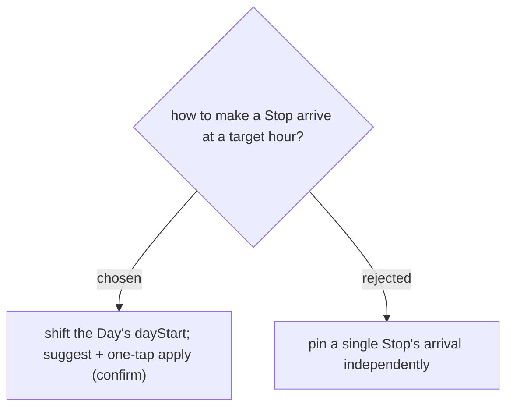

# Retiming lever = day-start shift, suggested then one-tap applied

Arrival is a *derived* value: `arrival[N] = dayStart + Σ legs + Σ dwell` (ADR-008). The only lever that moves it without breaking the pure cascade is the Day's **day start time** — shifting it by Δ moves every Stop's arrival by Δ. So retiming computes `dayStart' = dayStart + (targetHour − currentArrival[anchor])`, shows it as a suggestion ("เริ่มวัน HH:MM → ถึง HH:MM"), and applies on one tap (reusing SetDayStartTime, ADR-013). Pinning one Stop's arrival independently was rejected — it would need a new anchoring concept that contradicts the cascade invariant.

## Consequences

Retiming moves the **whole day** together, not one Stop — the other Stops on the anchor Day shift by the same Δ.
