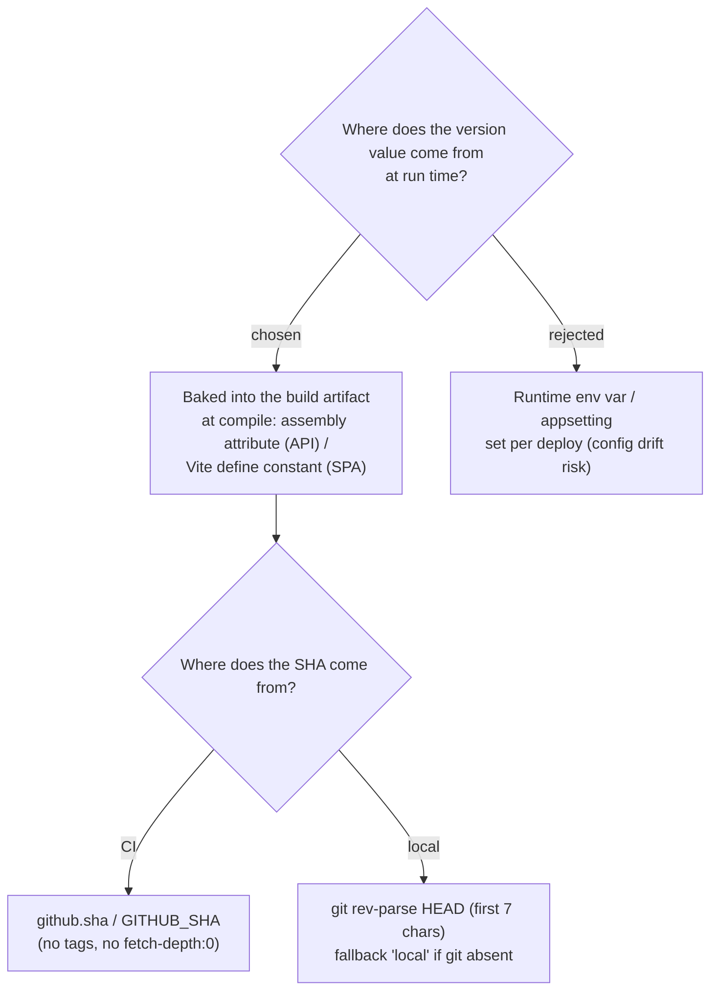

# ADR-109: Version is embedded at build time from git (CI git-context + local-git fallback), never runtime config

**Date:** 2026-07-20
**Status:** Accepted (owner chose "auto everywhere + buildTime")
**Relates to:** issue #41; ADR-107 (format), ADR-108 (endpoint). Backend build (`main_menunest.yml`), CI (`ci.yml`), frontend build (`azure-static-web-apps-green-rock-098e70e00.yml`); the frontend `import.meta.env` / Vite convention; the pre-commit hook that builds Release locally.

## Context

The version must travel *with* the artifact (so "what is deployed" can never disagree with "what config says"), work in CI **and** in local `dotnet run` / `npm run dev` (owner chose "auto everywhere"), and derive the SHA without the shallow-clone trap: both pipelines use `actions/checkout@v4` at its default depth (no tags, truncated history), so anything needing `git describe` / full history is out (ADR-107).

## Decision

Version data is **embedded into each build artifact at compile time**, never read from runtime configuration.

**Backend (.NET).** A `<Version>0.1.0</Version>` base lives in the project/`Directory.Build.props`. The .NET SDK appends `+<SourceRevisionId>` to `AssemblyInformationalVersionAttribute`; `SourceRevisionId` is set to the **short** SHA. CI passes it explicitly (`-p:SourceRevisionId=<short github.sha>`) for determinism; a small MSBuild target fills it from `git rev-parse HEAD (first 7 chars)` when unset (local builds), with `ContinueOnError` so a git-less build still compiles (SHA -> `local`). `buildTime` is injected as `[AssemblyMetadata("BuildTimestamp", ...)]` computed from MSBuild `UtcNow`. The `/version` endpoint reads all three back by reflection.

**Frontend (Vite).** `vite.config.ts` computes the string at build: base from `package.json` `"version"`, SHA from `process.env.GITHUB_SHA` (auto-provided in Actions -> short) or a local `git rev-parse HEAD (first 7 chars)` fallback (`local` if absent), `buildTime` from `new Date()`. Values are exposed as `define` compile-time constants (`__APP_VERSION__`, `__APP_COMMIT__`, `__BUILD_TIME__`), typed in `vite-env.d.ts`.

## Consequences

**Positive:** the deployed version is immutable and self-consistent; works identically in CI and locally; **the frontend needs no pipeline edit** (`GITHUB_SHA` is already present); the backend needs only a one-line property on its build step. No new App Settings, no config drift. **Negative:** injecting `UtcNow` makes builds non-reproducible by timestamp (irrelevant here); the backend relies on the SDK's `SourceRevisionId`->`InformationalVersion` append behaviour, documented here so a future reader isn't surprised the SHA "appears from nowhere". A git-less/exported-source build degrades gracefully to `0.1.0+local`.