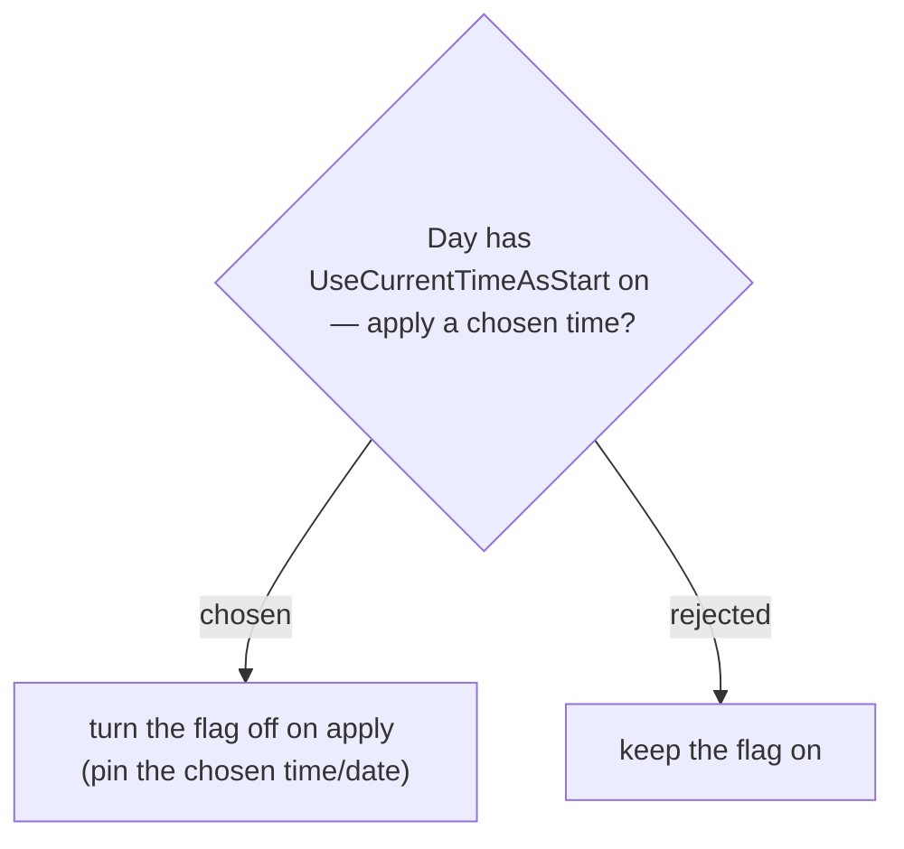

# Applying a retiming pins the Day (turns off UseCurrentTimeAsStart)

**Current-time-start** re-seeds a Day's start time (and, for a single-day Trip, its date) to "now" on every itinerary fetch (ADR-038/054). A chosen target hour and "always now" are mutually exclusive, so applying a **Weather-based retiming** turns `UseCurrentTimeAsStart` **off** for the anchor Day (reusing SetDayUseCurrentTime) — otherwise the next fetch would overwrite the applied start and the target would not stick. The apply preview states this ("จะปิด 'ใช้เวลาปัจจุบันเสมอ'").
