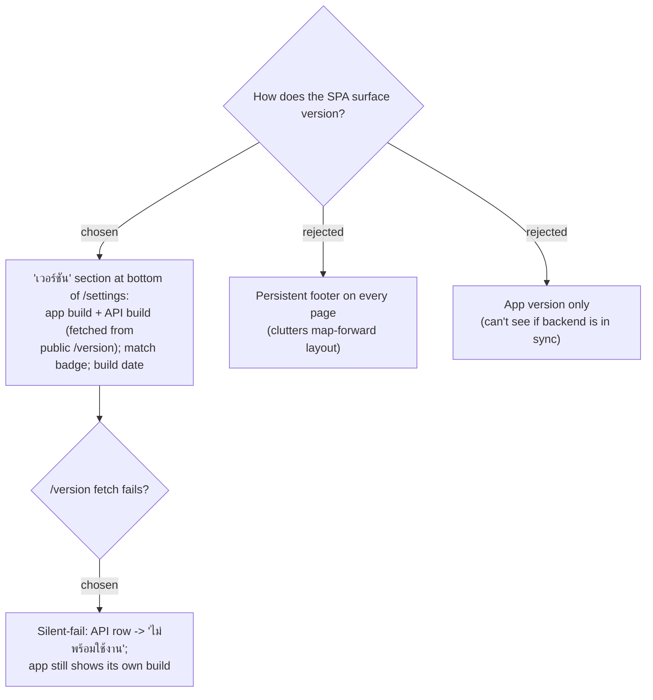

# ADR-110: SPA shows both app and API version on /settings; fetches public /version; match badge; silent-fail

**Date:** 2026-07-20
**Status:** Accepted (owner confirmed the design-system mock `screens/issue-41-version.html`)
**Relates to:** issue #41; ADR-107/108/109; the `/settings` page (`SettingsPage.tsx`) and its existing silent-fail-on-save pattern; the mock card **MenuNest design system -> Screens -> issue-41-version**.

## Context

The point of putting version on *both* sides (issue #41) is to see whether the deployed SPA and API came from the same commit. The `/settings` page is the conventional "about" home and already renders icon+title+sub rows; it also already swallows failures silently (a failed settings save shows nothing rather than an error affordance). The app is map-forward and the owner avoids clutter, so a global footer was rejected.

## Decision

A new **เวอร์ชัน** `.settings-row` at the bottom of `/settings` shows two lines -- **แอป** (the SPA's own build, from the ADR-109 Vite `define` constants, available instantly) and **API** (fetched from the public `GET /version`, ADR-108). When the two commit SHAs are equal it shows a green **ตรงกัน** badge; when they differ, an amber **ไม่ตรงกัน** badge (a normal transient state during a rolling deploy). An **อัปเดตล่าสุด** line shows the app build timestamp.

The `/version` fetch **fails silently**: while loading, the API row shows a skeleton; on any error (offline / 5xx / CORS) it shows a muted **ไม่พร้อมใช้งาน** and the app's own version still renders. No error popup, consistent with the page's existing behaviour. The four states are pinned in the mock (loaded/in-sync, loading, mismatch, offline).

Rejected: a persistent footer (visible everywhere but clutters every screen) and app-version-only (defeats the "see both in sync" purpose).

## Consequences

**Positive:** front+back sync is visible at a glance; no new page; reuses the settings-row look and the silent-fail ethos; the API-version call is the only new network dependency and it can't break the page. **Negative:** the match badge adds a small amount of comparison logic (SHA equality) and one extra request on the settings page -- both trivial. The mismatch state is expected briefly during deploys and is informational, not an error.