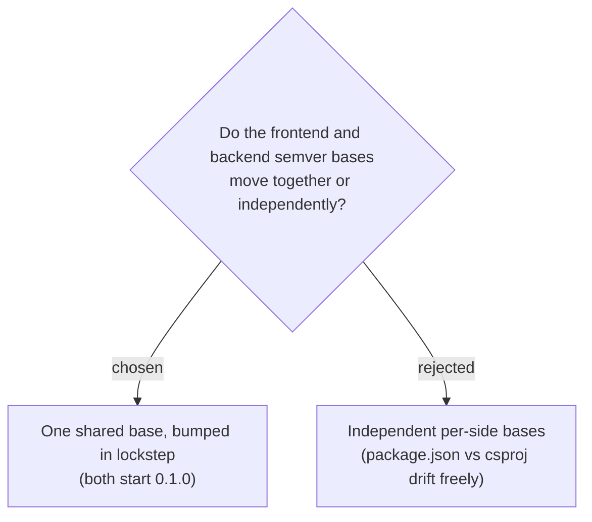

# ADR-111: Frontend and backend share one SemVer base, bumped in lockstep

**Date:** 2026-07-20
**Status:** Accepted
**Relates to:** issue #41; ADR-107 (format), ADR-110 (match badge). The two independent version sources: `frontend/package.json` `"version"` and the backend `<Version>` MSBuild property.

## Context

The version base lives in two files (frontend `package.json`, backend `<Version>`) because each toolchain reads its own. They *could* drift independently, but ADR-110's **ตรงกัน / ไม่ตรงกัน** badge compares the commit SHA -- and both sides deploy from the same commit on every push to `main`, so the SHA already proves same-commit. The base number is the human-facing "release" marker.

## Decision

The two bases are treated as **one logical version**, kept **equal** and bumped **together** in the same commit (both start at `0.1.0`). The SHA carries same-commit identity; the shared base carries release intent for both surfaces at once. There is no build-time enforcement that they match -- it is a documented convention (a future check could assert it, but is out of scope).

Rejected: letting the two bases version independently -- there is one product, one release cadence (deploy-on-push), so two diverging base numbers would only confuse "what release is this".

## Consequences

**Positive:** one number to reason about; the `ตรงกัน` badge stays meaningful (equal base + equal SHA = truly the same build across tiers). **Negative:** bumping a release means editing two files in one commit; if someone edits only one, the bases silently diverge (the SHA match still holds, so nothing breaks -- only the displayed base numbers would differ). Documented here so that divergence is recognised as a convention slip, not a bug.