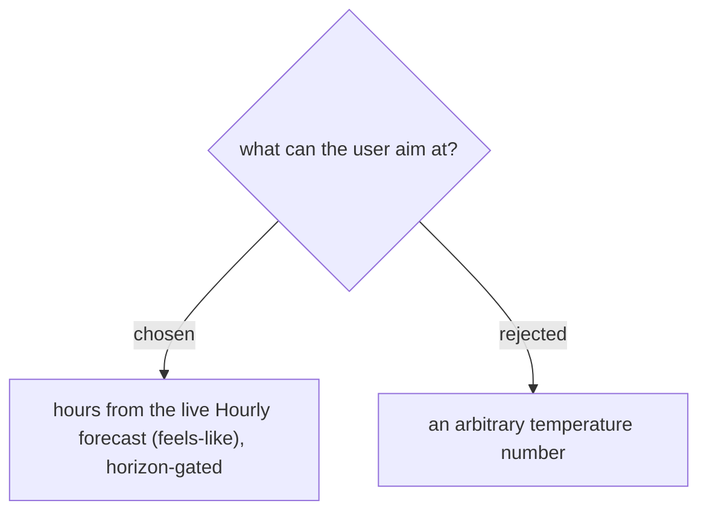

# Target values come from the real forecast (achievable hours), metric = feels-like

"Show the possible heat" — the selectable targets are the **actual hours of the Hourly forecast** (future hours within the 10-day horizon, on the anchor Day's date and, for a cross-day target, later dates), each labelled with its real **Feels-like** value. Feels-like (รู้สึก — the value the user circled) is the metric. An arbitrary "≤ X°" number was rejected as the primary input because it can name a temperature the day never reaches; instead an unreachable aim is reported honestly ("วันนี้เย็นสุด 30° ตอน 18:00"). No new stored setting is introduced.
