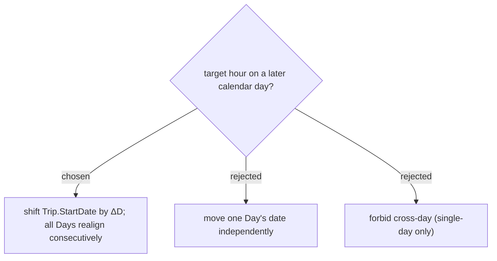

# A cross-day target shifts the whole Trip (StartDate realign), multi-day included

`ItineraryDay` has no free date — every Day is `Trip.StartDate + index`, with a unique `(TripId, Date)` index, and Reschedule realigns all Days when StartDate changes (`UpdateTripHandler`). So a cross-day target can only be honoured by shifting `Trip.StartDate` by `ΔD = targetDate − anchorDay.Date`, which lands the anchor Day on the target date and slides every other Day with it. This unifies single-day and multi-day under one formula. Moving one Day's date independently is impossible (it collides on the unique index); forbidding cross-day was rejected because the user asked for it.

## Consequences

The **whole Trip moves** — every other Day changes weekday, so its Stops' opening-hours / On-arrival weather change too. Apply must warn before committing (ADR-121 mockup: "ทั้งทริปจะเลื่อน X → Y, วันอื่นขยับตาม").
