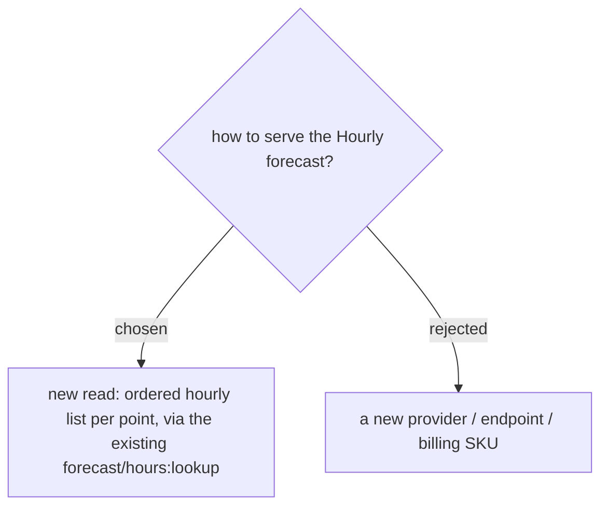

# Hourly forecast read reuses forecast/hours; no new billing SKU

A new backend read returns an ordered hourly list `[{hourIso, tempC, feelsLikeC, condition, iconBaseUri, rainPct, uvIndex, isDaytime}]` for a point, built from the **same** Google `forecast/hours:lookup` the On-arrival reading already walks (ADR-033) — so it adds no new provider and no new billing SKU (spirit of ADR-093), only surfaces more of the buckets already fetched (plus the `isDaytime` field). Any failure degrades to an empty / No-data result rather than throwing (ADR-030); responses cache like On-arrival (~1–3 h).
