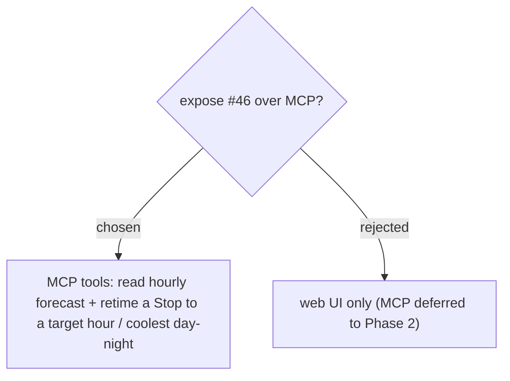

# Expose Hourly forecast + Weather-based retiming over MCP

Following ADR-034 (Trip use cases exposed over MCP), the feature is exposed as tools in `TripTools`: one to **read** a Stop's/point's **Hourly forecast**, and one to perform the **Weather-based retiming** (retime an anchor Stop to a target hour, or to coolest-daytime / coolest-nighttime), so an AI assistant can arrange trip timing around the weather. The retime tool applies the same writes as the UI — day-start shift, whole-Trip StartDate shift for cross-day (ADR-109), and turning off current-time-start (ADR-110) — and warns in its result when the whole Trip moves.
