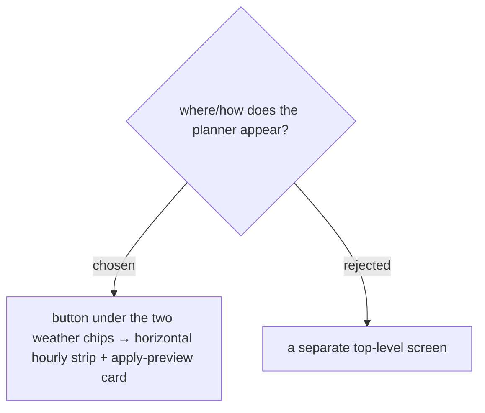

# UI: entry in StopDetailSheet + horizontal hourly timeline + apply preview

Entry is a button beneath the existing Now / On-arrival chips in the **StopDetailSheet** ("ดูอุณหภูมิรายชั่วโมง — เลือกเวลาไปถึงตอนอากาศที่ต้องการ"), exactly where the user pointed. The planner is a horizontal scrollable hourly strip — **Feels-like** as the headline per cell, a condition icon, the current-plan cell ringed, day/night tinting, a "พรุ่งนี้" divider — with the two quick actions above and an apply-preview card below that states the resulting start time and, for a cross-day / multi-day target, the whole-Trip-shift warning. A separate top-level screen was rejected as heavier than needed.

Confirmed mockup: MenuNest design system → Screens → **"Issue #46 — วางแผนไปถึงตอนอากาศที่ต้องการ"**.
