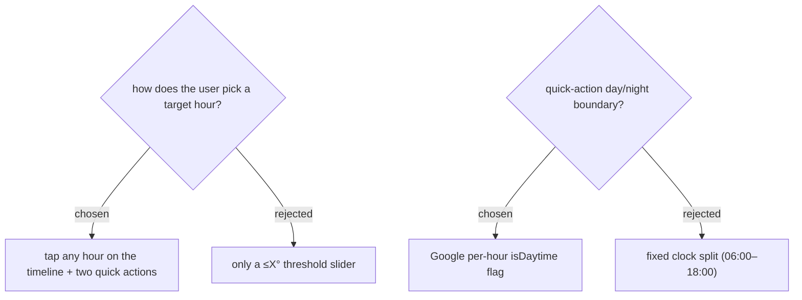

# Selection = tap any hour + coolest-daytime / coolest-nighttime quick actions

The user picks a target by tapping **any hour** on the **Hourly forecast** timeline, or via two shortcuts — **coolest-daytime** and **coolest-nighttime** — each resolving to the minimum feels-like hour within its half. Day vs night is the Google Weather per-hour **isDaytime** flag ("true if the hour is between local sunrise inclusive and sunset exclusive"), verified present in the `forecast/hours` response — sunrise/sunset-accurate per location and season, and free (already returned). A fixed clock split was rejected as less accurate; a threshold-only slider was rejected in favour of concrete, achievable hours (ADR-116).
