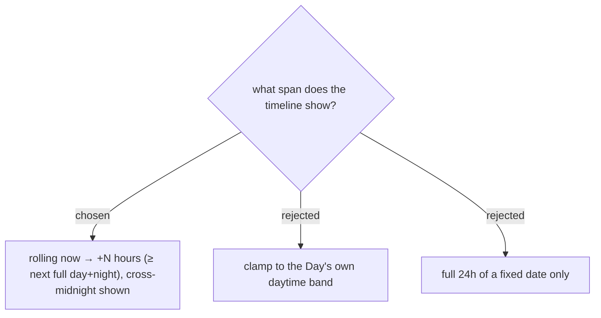

# Hourly forecast is a rolling now→+N window, cross-midnight visible

The timeline is a rolling forward window from the viewer's *now*, long enough to always contain the next full daytime **and** nighttime (so both quick actions in ADR-117 have candidates). It shows hours that cross midnight with a "พรุ่งนี้" divider, all selectable because cross-day targets are supported (ADR-114). It stays inside the 10-day forecast horizon; a Stop beyond it shows **No weather data** and no planner (ADR-031/030). N is a tunable constant (≥ 24 h).
