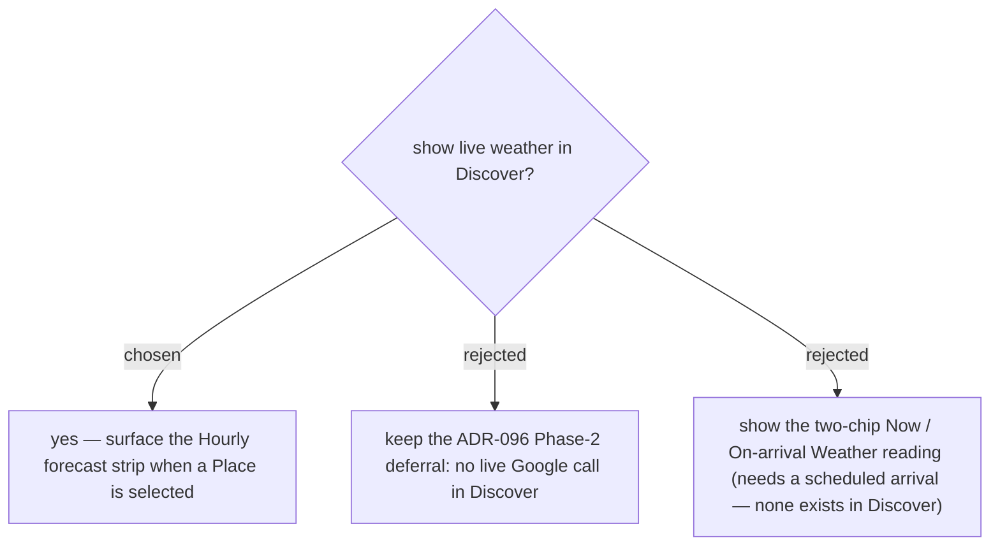

# Discover surfaces the live Hourly forecast (reverses the Phase-2 no-live-weather deferral)

Issue #47 ("แสดงสภาพอากาศรายชั่วโมงนี่นี่ด้วย") asks for hourly weather on the **Discover**
place-detail sheet (`PlaceSheet`). ADR-096 had deliberately deferred *live Weather reading in
Discover* to Phase 2 to keep Discover call-free (all four **Discovery signals** are computed from
already-stored data). We reverse that deferral **only for the Hourly forecast** — the one weather
surface #47 names — not the two-chip **Weather reading** (Now / On-arrival), which stays trip-only
because it needs a Stop's scheduled **arrival** that Discover has no concept of. The four
Discovery signals remain no-call; the Hourly forecast is a distinct, opt-in-by-selection surface.
Cost is bounded (see ADR-123) and reuses the existing `forecast/hours` walk — no new billing SKU
(ADR-119).