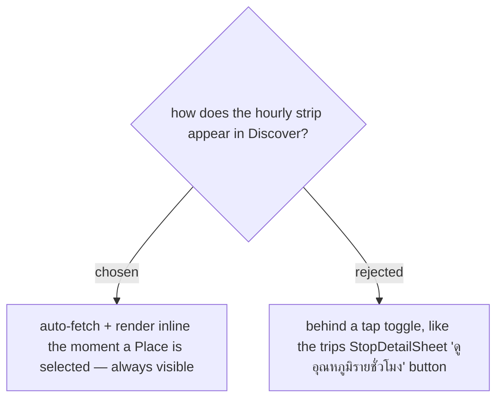

# Discover hourly strip is always visible, auto-fetched on Place selection (no toggle)

The trips **HourlyPlanner** is gated behind a tap (issue #46) because it also carries retiming. In
Discover the user asked for the forecast to **show directly** — no extra tap — and to **scroll
horizontally** when there are many hours. So the strip auto-fetches and renders as soon as the
`PlaceSheet` opens for a Place. The live Google call this implies is acceptably bounded: the detail
sheet renders for exactly **one selected Place at a time** (never all map pins), the RTK Query
result is cached (`keepUnusedDataFor: 600`, so re-selecting the same Place within 10 min does not
re-bill), and it reuses `forecast/hours` — no new SKU (ADR-119, ADR-122). While the call is in
flight the strip shows a skeleton; a provider failure / no-data degrades silently (ADR-030/031),
never blocking the rest of the card.