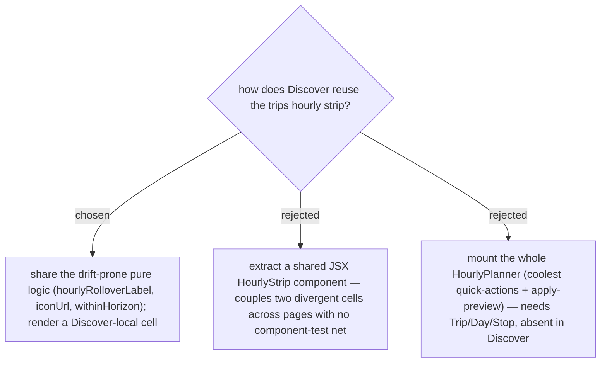

# Discover hourly is a display-only strip — no retiming; share pure logic, keep the cell page-local

**Weather-based retiming** (issue #46) drives an **Anchor Stop**'s **arrival** to a chosen hour by
shifting a **Day**'s start time. Discover has **no Trip / Day / Stop** — a discovered Place may sit in
zero, one, or many Trips — so the coolest quick actions and the "ปรับเลย" apply-preview are meaningless
there. Discover shows a **display-only** hourly strip.

On *how* to reuse: the trips cell (a tappable `<button>` showing only **Feels-like** — the actual temp /
rain live in the adjacent Now / On-arrival chips) and the Discover cell (an inert `
` showing temp +
feels-like + rain%) diverge enough that a shared JSX component would couple two pages — and the SPA has
**no component/DOM test harness** (CLAUDE.md), so a shared component's correctness would rest entirely on
interactive testing of *both* pages on every change. So we share only the genuinely **drift-prone pure
logic** — the date-rollover label (`hourlyRolloverLabel`, extracted to `trips/lib/weather.ts` and
unit-tested), plus the existing `iconUrl` and `withinHorizon` — and render a small **Discover-local**
`DiscoverHourly` cell with its own `.disc-wx*` CSS. Trips' `HourlyPlanner` is otherwise untouched beyond
importing the shared rollover helper, keeping the #46 blast radius near-zero.