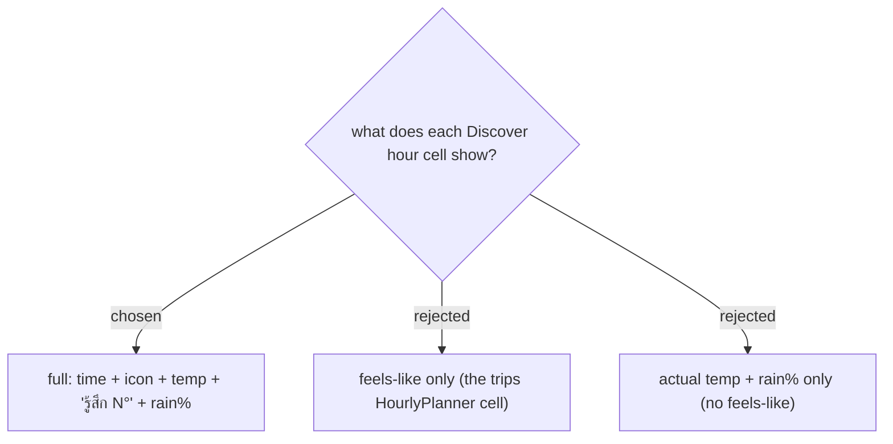

# Discover hourly cell shows the full reading: temp + feels-like + rain%

In **trips**, the hour cell shows only **Feels-like** because the rich reading (actual temp, rain,
condition, **UV index**) already lives in the two Now / On-arrival **Weather reading** chips beside
it. Discover's `PlaceSheet` has **no** such chips, so the hourly strip is the *only* weather surface
— it carries the full per-hour reading: **time** (first cell labelled "ตอนนี้"), the Google
**condition icon** (tinted by **isDaytime**), **actual temperature** as the headline, **"รู้สึก N°"**
(**Feels-like**), and **rain %** (0% rendered faint as "แห้ง"). All five fields already exist on the
`HourlyReadingDto` from issue #46 — **no new API call, endpoint, DTO field, or billing SKU**. The
strip reuses the coordinate-based `POST /api/trips/weather/hourly`
(`GetHourlyForecastQuery(Lat, Lng, Hours)`), a **48-hour** window (same `WINDOW_HOURS` as trips), and
the `withinHorizon` guard that drops past hours and anything beyond the 10-day forecast horizon
(ADR-031, ADR-118). A small "ตอนนี้ N° · รู้สึก N°" summary sits top-right of the section as an
optional at-a-glance (kept per the confirmed mockup; cheap to drop).