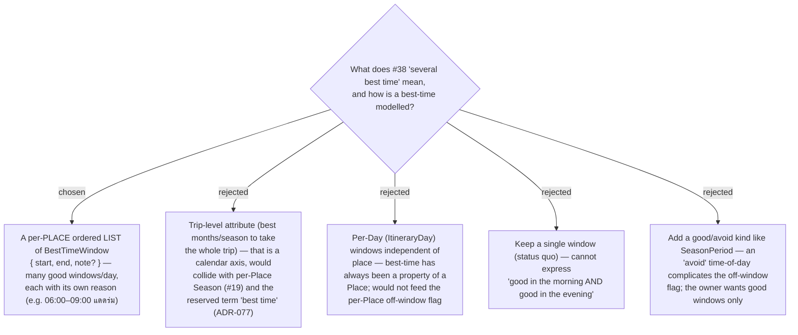

# ADR-126: Best-time is a per-Place LIST of BestTimeWindow value objects {start, end, note}, good-only — not a single window, not trip-level

**Date:** 2026-07-22
**Status:** Accepted (owner disambiguated issue #38's ambiguous title during grilling)
**Relates to:** issue #38; ADR-072 (Season as a per-Place value-object LIST — the pattern this mirrors on the *time-of-day* axis); ADR-077 (season vocabulary — "best time" is reserved for the time-of-day window, which this stays); ADR-020 (the off-window Timing flag that consumes it); ADR-096 (the Discover best-time-of-day signal that consumes it); ADR-063/064 (the master / per-trip-override lifecycle it rides). Supersedes the single-window `BestTimeStart`/`BestTimeEnd` scalar model.

## Context

Issue #38 ("add best times for trip, the trip should have several best time") was ambiguous between a new trip-level attribute and multi-valued per-place windows. The owner disambiguated during grilling: **"แบบหนึ่งวันมีเวลาที่ดีได้หลายครั้ง เช่น ช่วงเช้าดีเพราะแดดร่ม ช่วงเย็นดีเพราะแดดร่ม"** — one Place can have several good time-of-day windows within a day, each with a reason. Today best-time is a single `[BestTimeStart, BestTimeEnd]` window per Place (`TimeOnly?` scalars on both `TripPlace` and `PlaceProfile`), consumed by the off-window Timing flag and the Discover best-time-of-day signal. A single window cannot hold "morning good (shade) and evening good (shade)." The Season feature (#19, ADR-072) already established the per-Place value-object-LIST shape on the calendar-month axis; this applies the same shape on the time-of-day axis.

## Decision

**A Place's best-time is an ordered LIST of `BestTimeWindow` value objects, all "good".**

- `BestTimeWindow` = `{ start: TimeOnly, end: TimeOnly (end > start), note?: string }`.
- The **note** is the optional reason for the window (e.g. "แดดร่ม"); the window is valid without one.
- No good/avoid **kind** — every window is a "good"/"ควรไป" window. Anything *outside all* windows is treated as off-window (see the off-window Timing flag ADR).
- A **Place** (`TripPlace`) and its **PlaceProfile** master each hold this list, persisted as **JSON** — mirroring the `SeasonPeriods` / `ReviewLinks` EF pattern (a `ValueConverter` + a collection `ValueComparer`, one `nvarchar(max)` column defaulting to `'[]'`).
- **Optional** — a Place may have zero windows (unchanged from today's "no best-time set").
- The term stays **"best time"** (time-of-day), consistent with ADR-077; it is now plural ("best-time windows"), never a calendar/season concept.

### Rejected

- **Trip-level (B)** — the literal title reading; a "best time to take the whole trip" is a calendar-month axis that would duplicate/conflict with per-Place Season (#19) and misuse the reserved term "best time" (ADR-077). Not what the owner meant.
- **Per-Day (C)** — best-time has always been anchored to a Place ("this temple is best at sunrise"); a day-level list would not connect to the per-Place off-window flag or the Discover signal.
- **Single window / good-avoid kind (D, E)** — a single window can't express several good windows; an avoid kind adds off-window-flag ambiguity the owner does not want.

## Consequences

**Positive:** arbitrary number of good windows per Place, each with its own reason; reuses the shipped Season/Review-links JSON-list plumbing (converter + comparer, master/per-trip lifecycle, MCP full-replace); keeps "best time" meaning time-of-day. **Negative / follow-on (grilled separately):** the scalar `BestTimeStart`/`BestTimeEnd` columns and their prod data must be migrated into the list (ADR to follow); `TripPlaceDto`/`PlaceDto`/`DiscoverPlaceDto`, the MCP `update_trip_place`/`push_place_profile` contracts, the REST `UpdatePlaceBody`, and the single-window `BestTimeBar` editor all change from a scalar pair to a collection (the positional-DTO blast radius flagged for #19/#37); the off-window Timing flag and the Discover match become "inside ANY window" (ADRs to follow).
