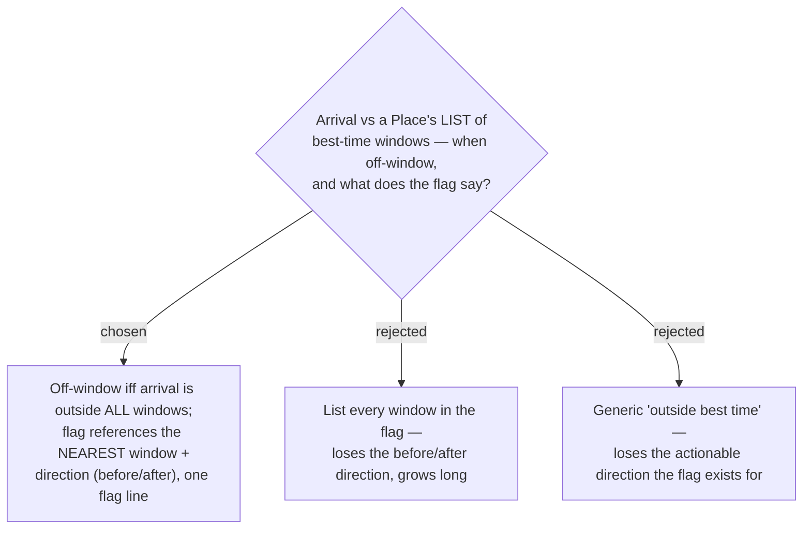

# ADR-127: With multiple best-time windows, a Stop is off-window only when arrival is outside ALL windows; the flag references the nearest window

**Date:** 2026-07-22
**Status:** Accepted
**Relates to:** issue #38; ADR-126 (best-time is now a window LIST); ADR-020/021 (the three Timing-flag types and their severities/priority); ADR-019 (a Timing flag states a reason + a fix). Extends ADR-020's off-window semantics from a single window to a list.

## Context

ADR-126 makes best-time a per-Place list of good windows. The off-window Timing flag ([useSchedule.ts](frontend/src/pages/trips/hooks/useSchedule.ts) `offWindowFlag`) currently compares a Stop's computed arrival against a single `[start, end]` window and reports a `before`/`after` direction (ADR-020). With several windows the "inside/outside" and "which direction" questions both need a rule.

## Decision

- A Stop is **off-window** iff its computed **arrival** falls **outside every** best-time window (inside any one window ⇒ no off-window flag).
- When off-window, the flag references the **single nearest window** — the window with the smallest time gap to arrival — and keeps the existing `before`/`after` **direction** relative to that nearest window (arrival earlier than the nearest window ⇒ "before"; later ⇒ "after"). This keeps the flag a single actionable line ("ถึง 12:30 · เลยช่วงเหมาะ 06:00–09:00 — รอ 17:00–19:00" style copy, exact wording finalised in the spec/mock).
- **Unchanged:** off-window stays severity **suggestion** (amber), stays **last** in the priority cascade (overflow > closed > off-window), and only the single most-severe flag shows per Stop (ADR-020). A Place with zero windows raises no off-window flag (unchanged from today's "no best-time set").

### Rejected

- **List-all (B)** — enumerating every window drops the before/after direction and reads long on the compact Stop card.
- **Generic message (C)** — loses the direction/fix that makes the flag actionable (ADR-019).

## Consequences

`offWindowFlag` and the `TimingFlag` off-window fields (`bestStart`/`bestEnd`/`windowDir`) are recomputed from the nearest window instead of the sole window — a localized change; the flag's shape and copy structure stay one-line. The "nearest window" tie/gap logic is pure and belongs in a unit-tested lib helper (frontend has no DOM test harness).
