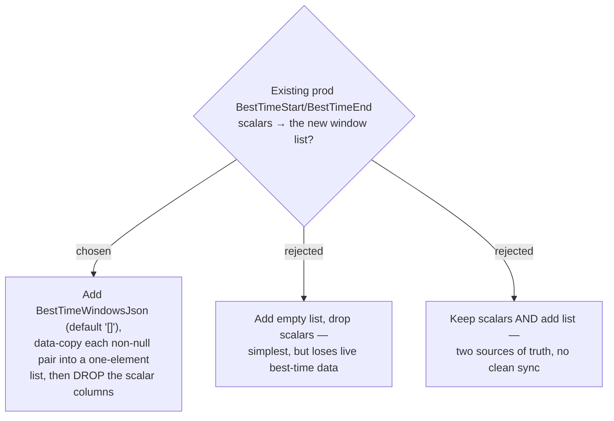

# ADR-128: Migrate the existing single-window best-time into the list and DROP the scalar columns (no data loss, one model)

**Date:** 2026-07-22
**Status:** Accepted
**Relates to:** issue #38; ADR-126 (best-time is now a window LIST); ADR-072/073 (`SeasonPeriodsJson` — the JSON-column migration this mirrors). Project constraint: migrations are applied to prod **manually** (CLAUDE.md), so the migration must be idempotent-previewable and its data-copy verified before running.

## Context

Best-time is stored today as two nullable `time` columns — `BestTimeStart`/`BestTimeEnd` — on both `TripPlaces` and `PlaceProfiles`, and those tables already hold live prod data (the #19/#37 migrations are applied). ADR-126 replaces the scalar pair with a JSON list. Prod best-time values must survive the change, and we want a single source of truth (no lingering scalar columns).

## Decision

One EF migration, applied to both host tables (`TripPlaces`, `PlaceProfiles`):

1. **Add** `BestTimeWindowsJson` (`nvarchar(max)`, `NOT NULL DEFAULT '[]'`) — same shape as `SeasonPeriodsJson`.
2. **Data-copy:** for every row with a non-null `[BestTimeStart, BestTimeEnd]`, set `BestTimeWindowsJson` to a one-element JSON array holding that window with a null note — e.g. `[{"start":"06:00:00","end":"09:00:00","note":null}]`. The emitted JSON **must byte-match** what the C# `ValueConverter` produces (System.Text.Json `Web` defaults → camelCase keys, `TimeOnly` → `"HH:mm:ss"`); verify against an actual serialized `SeasonPeriodsJson`/round-trip before running on prod.
3. **Drop** the `BestTimeStart` and `BestTimeEnd` columns.

Preview with `dotnet ef migrations script --idempotent` and apply by hand per CLAUDE.md.

### Rejected

- **Drop-and-lose (B)** — throws away every best-time a user already set.
- **Keep-both (C)** — two representations of the same fact with no defined precedence; the exact ambiguity ADR-126 removes.

## Consequences

Existing single windows become the first element of the new list, note-less — visually identical to before for one-window places. The scalar columns and their `TimeOnly?` properties disappear from the entities, EF configs, snapshot, and all three `IApplicationDbContext` implementers. The migration is **not** trivially reversible (a `Down` can recreate the columns and copy back the *first* window, dropping any extras) — an acceptable one-way narrowing on rollback.
