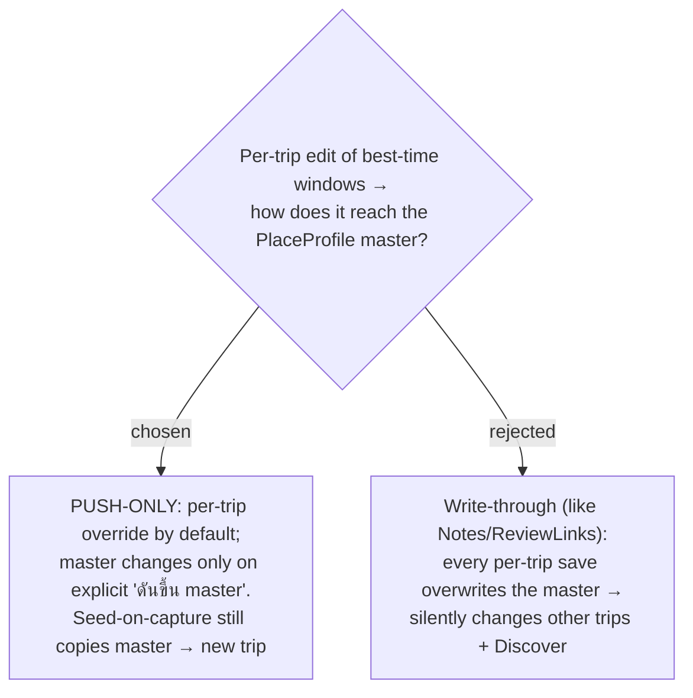

# ADR-129: Best-time windows stay PUSH-ONLY to the master (per-trip override by default), not write-through

**Date:** 2026-07-22
**Status:** Accepted
**Relates to:** issue #38; ADR-126 (best-time is now a window list); ADR-063/064 (master / per-trip-override / seed-on-capture / push-to-master lifecycle); ADR-103 (the write-through vs push-only asymmetry: Notes + ReviewLinks write through; best-time, season, checklist stay push-only). Keeps best-time on the same side of ADR-103 it was already on.

## Context

Best-time (single-window) is already **push-only** under ADR-103: editing it in one trip is a per-trip override, and it reaches the master only via the explicit "ดันขึ้น master" (`push_place_profile`). ADR-103 deliberately splits enrichment — Notes + Review links write through on every save (they're reference data users want fresh on Discover), while best-time, season, and checklist stay push-only (they're planning judgements a user may legitimately want different per trip). Making best-time a list (ADR-126) reopens the question for the new shape.

## Decision

**Best-time windows stay push-only.** A per-trip edit changes only that Trip's `TripPlace.BestTimeWindows` (a per-trip override); the `PlaceProfile` master's windows change only when the user explicitly pushes to master. **Seed-on-capture** still copies the master's windows into a newly captured Place (`PlaceProfileSync.SeedIntoAsync`), and **first-enrichment auto-create** and **push** (`UpsertFromAsync`) carry the whole window list, exactly as SeasonPeriods do.

### Rejected

- **Write-through (B)** — would make editing best-time for one trip silently rewrite the master and therefore every other trip's seed and the Discover signal. Best-time is a per-trip planning judgement (the morning window that suits *this* trip's plan may not suit another); surprising cross-trip mutation is the wrong default. Consistency with ADR-103's classification (best-time = push-only) also matters.

## Consequences

`PlaceProfileSync` copies `BestTimeWindows` as a whole list on seed and push (mirroring its `SetSeasonPeriods` handling), and `WriteThroughNotesAndLinksAsync` continues to **exclude** best-time. No new user-facing surface beyond the existing "ดันขึ้น master" affordance, which now pushes the window list too.
