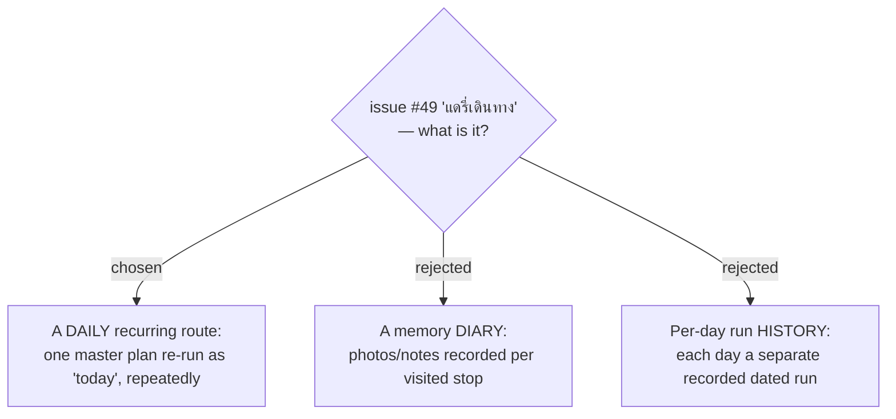

# ADR-130: "แดรี่เดินทาง" is a *daily* recurring "run-as-today" route — not a memory diary, and it keeps no per-run history

**Date:** 2026-07-23
**Status:** Accepted
**Relates to:** issue #49; ADR-054/055/056 (single-day **Current-time-start** re-seeds date+time to the viewer's today — the mechanism this reuses).

## Context

The issue title reads "diary", but grilling resolved the user's intent to **daily** (ทำซ้ำทุกวัน): one master plan you "กดเดินทาง" repeatedly, e.g. a commute. The Thai "แดรี่" is *daily*, not *diary*.

## Decision

A daily route is a plan you re-run **as today**, over and over. **Nothing is recorded per run** — opening it simply re-projects the one master plan as today (exactly the existing single-day + **Current-time-start** evergreen behaviour). There are no per-day run instances, no streak log, no per-stop memories.

### Rejected

- **Memory diary (B)** — would need a media/blob model and per-stop notes; not what the user wants.
- **Per-run history (C)** — would need a dated run-instance entity; the user explicitly chose "no history — just re-run master as today".
