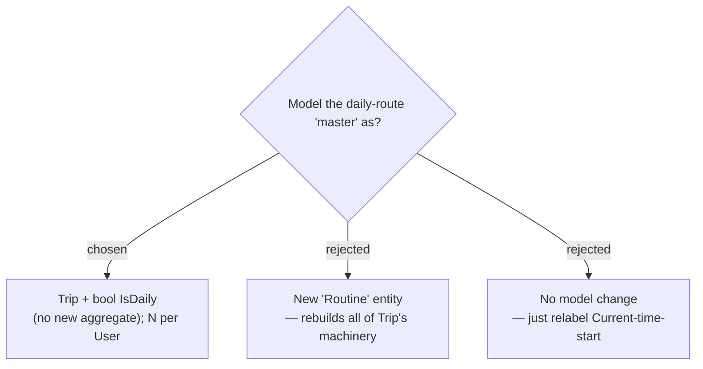

# ADR-131: A daily trip reuses the Trip aggregate via an `IsDaily` flag — not a new entity; many allowed

**Date:** 2026-07-23
**Status:** Accepted
**Relates to:** issue #49; ADR-130 (daily = recurring run-as-today); ADR-005 (Trip is user-scoped).

## Context

A daily route is a **Trip** in every respect — a pool of **Places**, an ordered **Itinerary** of **Stops**, the map, weather, and the **Navigate hand-off**. It differs only in *how it is run* (as today, repeatedly).

## Decision

Add a single boolean **`IsDaily`** on the `Trip` aggregate. No new entity, no new read model beyond what the trips list already returns. A **User** may have **many** daily trips (commute, gym, shopping run) — each an ordinary Trip carrying the flag.

### Rejected

- **New Routine entity (B)** — would duplicate the entire Trip → Day → Stop model, its map/route/weather wiring, and its endpoints, for no domain gain.
- **Pure relabel (C)** — reusing **Current-time-start** with no flag can't distinguish "my recurring route" from "a one-day trip I happened to open as today"; the user asked for a distinct **ประจำวัน** category.
