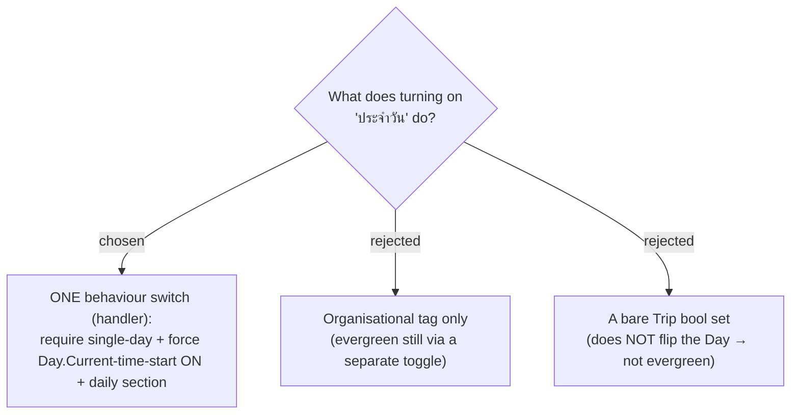

# ADR-132: `IsDaily` is one behaviour switch — enabling requires single-day and forces the day's Current-time-start on (a handler op, not a bare bool set)

**Date:** 2026-07-23
**Status:** Accepted
**Relates to:** issue #49; ADR-131 (`IsDaily` flag on Trip); ADR-133 (single-day guard); ADR-137 (command surface); ADR-054/055/056 (single-day Current-time-start reseed). Grounded by the #49 code-study workflow (2026-07-23).

## Context

"ประจำวัน" is a per-**Trip** concept, but the evergreen date+time reseed lives on a per-**Day** flag (`ItineraryDay.UseCurrentTimeAsStart`), and the *full* date float only fires when the trip has exactly one Day (`GetItineraryHandler`: `singleDay = days.Count == 1`). The user wanted **one switch** that "just does it".

## Decision

Enabling **`IsDaily`** is a single **handler** operation (not a bare property set — the code study confirmed `Trip` has **no Days navigation**, so a domain-only `Trip.SetDaily(true)` cannot reach the Day and would leave the trip **non-evergreen**):

1. **Require single-day** — reject with a `DomainException` if `DayCount != 1` (never auto-collapse — ADR-133). The verb is *require/reject*, not *force-collapse*.
2. **Set** `Trip.IsDaily = true`.
3. **Load the single `ItineraryDay` and call `SetUseCurrentTimeAsStart(true)`** — this is what actually makes the trip evergreen (date + start-time reseed to the viewer's today on every itinerary read, because `days.Count == 1`).
4. The Trip then appears in the **"ประจำวัน"** section of `/trips` (ADR-136).

The switch is reachable both at **create** (create-as-daily, pinning `DayCount = 1`) and on an existing single-day trip's **detail page** (ADR-137). The user never has to also find the standalone current-time-start toggle — which is then locked (ADR-134).

### Rejected

- **Tag-only (B)** — leaves the user to wire the evergreen behaviour themselves.
- **Bare Trip bool (C)** — sets the flag but never flips the Day's `UseCurrentTimeAsStart`, so the trip is silently *not* evergreen; the whole point is lost.

## Consequences

Because `IsDaily` forces the day flag on, **every** `GetItinerary` read of a daily trip now requires a valid `TimeZoneId` (the handler throws `DomainException` otherwise). The SPA always supplies it; **MCP `get_itinerary` callers must pass one** for a daily trip or the read throws. Disabling `IsDaily` leaves `UseCurrentTimeAsStart` at its current value and merely unlocks it (the user's earlier decision — no hidden side effect on disable).
