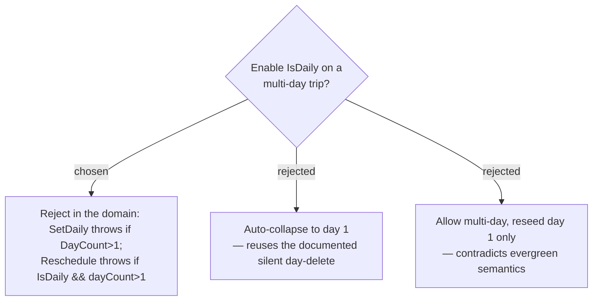

# ADR-133: A trip can be marked daily only while it is single-day — guard in the domain (`SetDaily` + `Reschedule`), non-destructive

**Date:** 2026-07-23
**Status:** Accepted
**Relates to:** issue #49; ADR-132 (enable forces single-day + Current-time-start); ADR-137 (command surface). Grounded by the #49 code-study workflow (2026-07-23): `Trip.Reschedule` is the ONLY DayCount mutator; `UpdateTripHandler` already deletes surplus days as documented silent data loss.

## Context

A daily route is one day repeated; a multi-day daily trip has no coherent meaning, and the full date reseed only fires for a single-day trip (ADR-054, `days.Count == 1`).

## Decision

Two guards, both in the **domain aggregate** (so no caller — command, MCP, or future — can bypass them):

1. **Enable guard** — the enable path (a new `Trip.SetDaily(true)` / the create-as-daily path) throws `DomainException` when `DayCount > 1`. Non-destructive: it **rejects**, it does not delete days.
2. **Stay-single-day guard** — `Trip.Reschedule(startDate, dayCount)` throws when `IsDaily && dayCount > 1`. `Reschedule` is the single chokepoint both `UpdateTripHandler` and `RetimeStopToHourHandler` funnel through; the throw fires at `UpdateTripHandler`'s `Reschedule` call **before** its silent surplus-day-deletion block, so a daily trip can never be silently shrunk. `RetimeStopToHour` passes `trip.DayCount` unchanged, so it is unaffected.

The guard is **not** validator-only (a validator would miss non-command callers). The frontend disables the day-count stepper / multi-day end-date editor for daily trips and surfaces the reject as a **user-facing error**, never a raw 500.

### Rejected

- **Auto-collapse (B)** — would reuse `UpdateTripHandler`'s documented silent day-delete; destroys the user's other days without consent.
- **Multi-day daily (C)** — only day 1 could reseed the date; days 2..n freeze on stale dates, contradicting "runs as today".
