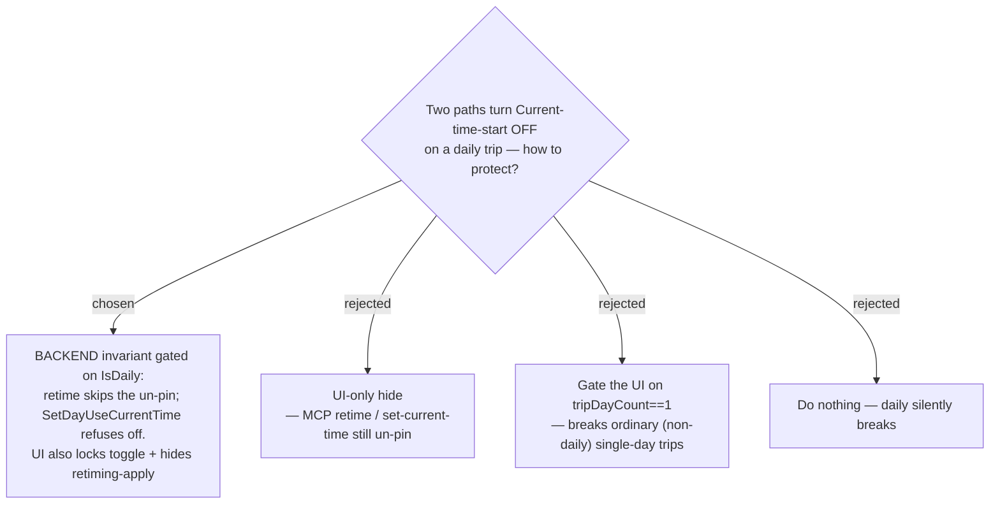

# ADR-134: On a daily trip the evergreen invariant is enforced in the BACKEND (not UI-only), gated on `IsDaily` (not day count)

**Date:** 2026-07-23
**Status:** Accepted
**Relates to:** issue #49; ADR-132 (`IsDaily` forces Current-time-start on); ADR-115 (retiming apply turns Current-time-start **off**). Grounded by the #49 code-study workflow (2026-07-23), which refuted the original "hide the UI" plan on two counts.

## Context

`IsDaily` implies **Current-time-start ON** (ADR-132), but two existing paths turn it **OFF**: the standalone "ใช้เวลาปัจจุบันเสมอ" toggle (`SetDayUseCurrentTime`), and **Weather-based retiming** apply — which un-pins at a single backend spot (`RetimeStopToHourHandler`: `day.SetUseCurrentTimeAsStart(false)`, ADR-115) and is reached by both the SPA `retime` endpoint and the **MCP `retime_stop_to_weather`** tool. The study also found the retiming/day-start UI components only know `tripDayCount`, **not** `IsDaily`.

## Decision

Protect the invariant in the **backend**, gated on **`IsDaily`** (the correct signal — gating on `tripDayCount == 1` would wrongly disable retiming for *ordinary* single-day trips, which are common and must keep it):

- **`RetimeStopToHour`**: when `trip.IsDaily`, do **not** perform the un-pin (skip `SetUseCurrentTimeAsStart(false)`) — or reject the retime. Covers both the SPA and MCP weather-retime paths (the latter delegates to it).
- **`SetDayUseCurrentTime`**: when `trip.IsDaily`, **refuse** to set the flag to `false`.
- **UI (defence-in-depth, gated on `trip.IsDaily` threaded down from `GetTrip`)**: show the current-time-start toggle **locked-on** and suppress its `onChange`; **hide only the retiming apply / suggestion card** inside `HourlyPlanner` — the display-only **Hourly forecast** strip stays visible.

### Rejected

- **UI-only (B)** — leaves the two MCP back-doors open; a daily trip silently reverts to a fixed date on the next open.
- **Gate on day count (C)** — `HourlyPlanner`/`DayStartEditor` know `tripDayCount` but not `IsDaily`; using day count would break non-daily single-day trips. Thread `IsDaily` instead.
- **Do nothing (D)** — the latent bug this ADR exists to prevent.
