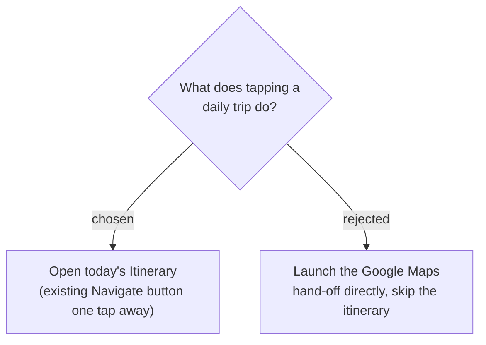

# ADR-135: "เดินทางวันนี้" just opens today's itinerary — no dedicated navigate action

**Date:** 2026-07-23
**Status:** Accepted
**Relates to:** issue #49; ADR-011 (Navigate hand-off — the existing external-Maps deep link); the map-forward UI preference.

## Context

A daily trip is already evergreen, so opening it shows "today" with no extra step. The user framed the interaction as "กดเดินทาง", but on inspection wanted to *see* the plan, not auto-launch navigation.

## Decision

Tapping a daily trip card opens the **normal Itinerary view** showing today (map + Stops + weather) — **no new action** and **no auto-launch** of the external Maps hand-off. The existing per-day/per-Stop **Navigate hand-off** (ADR-011) remains the way to start turn-by-turn navigation, one tap away as on any trip.

### Rejected

- **Direct hand-off (B)** — jumps straight to Google Maps, skipping the map-forward in-app plan the user prefers to glance at first; also duplicates an affordance that already exists.
