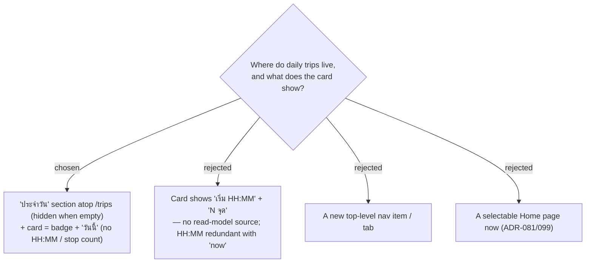

# ADR-136: Daily trips surface as a "ประจำวัน" section atop `/trips`; daily card = badge + "วันนี้" (no new read-model data), no new nav

**Date:** 2026-07-23
**Status:** Accepted
**Relates to:** issue #49; ADR-131 (`IsDaily` flag); ADR-081/099 (selectable Home page — Phase 2). Grounded by the #49 code-study workflow (2026-07-23): the list `TripDto` carries no day start-time or stop count, and a daily day starts "now" (evergreen), so a fixed "เริ่ม HH:MM" has no honest source.

## Context

The `/trips` list is one flat grid of trip cards (name · destination · N วัน · startDate), partitioned client-side. Daily trips read differently (always "today", one day). The list read model (`TripDto`, `ListTrips` projection) has **no** day start-time and **no** stop count.

## Decision

- Split `/trips` into a pinned **"ประจำวัน"** section (daily trips first, ordered most-recently-updated) above the normal **"ทริป"** section. The "ประจำวัน" section is **hidden entirely when the user has no daily trips**.
- A **daily card** shows a **"ประจำวัน" badge** and a **"วันนี้"** line, replacing the fixed start-date line. It does **not** show a start time or stop count — neither is in the list read model, and the start is "now" anyway (evergreen), so a fixed HH:MM would be misleading. This keeps the change to `TripDto`'s existing fields (+ the `IsDaily` flag) with **no extra `ItineraryDay`/`Stop` join**.
- The badge is an **inline-SVG** glyph added to `TripFormIcons.tsx` (never an emoji). While touching these files, fix the two pre-existing emoji rule-violations: `TripsPage.tsx` (`🧳`) and `TripDetailPage.tsx` (`🗺️`).
- **No new navigation item.** The "โหมดประจำวัน" switch lives on the trip **detail** header (beside the date editor) and in the **create** dialog (ADR-132/137). Making a daily trip a selectable **Home page** (ADR-081/099) is a natural **Phase-2** add, out of scope now.

Confirmed mock: Claude Design → **"MenuNest design system"** → Screens → **"Issue #49 — ทริปประจำวัน (Daily trips)"**.

### Rejected

- **Card with HH:MM + N จุด (B)** — no source in the list read model, and "เริ่ม HH:MM" contradicts the evergreen "start = now"; would force an extra join for redundant/misleading data.
- **New nav/tab (C)** — over-weights a flag-on-a-Trip feature.
- **Home page now (D)** — additive on top of the section; keep it Phase 2.
