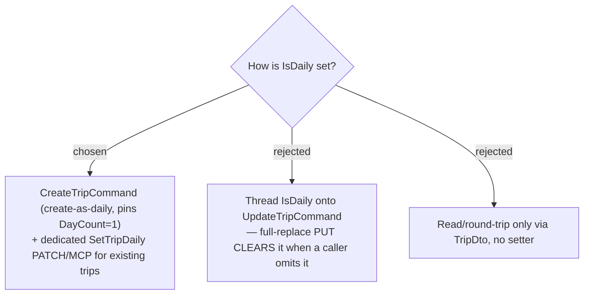

# ADR-137: Set `IsDaily` via `CreateTrip` (create-as-daily) and a dedicated `SetTripDaily` toggle — never via `UpdateTrip`

**Date:** 2026-07-23
**Status:** Accepted
**Relates to:** issue #49; ADR-131/132 (`IsDaily` + enable semantics). Grounded by the #49 code-study workflow (2026-07-23): `TripDto`/`CreateTripCommand`/`UpdateTripCommand` are **positional records**; `UpdateTrip` is a **full-replace PUT**; the codebase already has a single-purpose PATCH-toggle idiom (`SetDayUseCurrentTime`).

## Context

Surfacing the flag needs two things: **reading** it (the `/trips` section + the itinerary lock read `TripDto.IsDaily`) and **setting** it (create-as-daily, and toggling an existing trip). `UpdateTrip` is a full-replace PUT that several callers build by spreading every trip field (e.g. `TripDateEditor`); adding `IsDaily` there means any caller that omits it silently **clears** daily mode.

## Decision

- **Read:** append `IsDaily` as the **last** positional param of `TripDto` (avoids shifting existing args); update all four construction sites — `CreateTripHandler`, `UpdateTripHandler`, `GetTripHandler` (`.Select`), `ListTripsHandler` (`.Select`) — plus the frontend `TripDto` interface, in **one commit** (the pre-commit hook runs the full suite). No test constructs `TripDto` directly, so there are no test-site breaks.
- **Set at creation:** `CreateTripCommand` gains an `IsDaily` flag (default `false`); when `true`, the handler pins `DayCount = 1` and seeds the day with `UseCurrentTimeAsStart = true` (ADR-132). Create is one-shot, so there is no full-replace "clear" hazard.
- **Toggle an existing trip:** a **dedicated `SetTripDailyCommand(TripId, IsDaily)`** → `PATCH /api/trips/{id}/daily` → returns the updated `TripDto`, mirroring `SetDayUseCurrentTime`. The handler runs the ADR-132 enable logic (guard `DayCount == 1`, set the flag, flip the single day's `UseCurrentTimeAsStart`). Exposed over MCP as **`set_trip_daily`**.
- **`UpdateTripCommand` is left untouched** and never reads/writes `IsDaily`, so a start-date/name/day-count edit can never clear the flag.

### Rejected

- **On `UpdateTrip` (B)** — full-replace semantics silently clear `IsDaily` on any partial caller; also breaks the positional command's test/MCP/controller sites for no benefit.
- **Read-only, no setter (C)** — there would be no way to turn daily on/off.

## Consequences

The frontend "โหมดประจำวัน" switch calls the new `setTripDaily` mutation (not `updateTrip`), which invalidates `Trips` + `TripDetail` so the list section and header re-render. Because Get/List project `IsDaily` in server-side SQL, the migration adding the `Trips.IsDaily` column **must be applied to prod by hand before the code deploys** (CLAUDE.md), or every trips read 500s with "Invalid column name".
