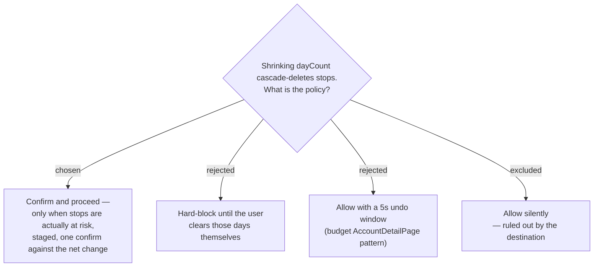

# ADR-138: A day-count **Shrink** confirms before it destroys — gated on real stop loss, and staged rather than autosaved

**Date:** 2026-08-01
**Status:** Accepted
**Relates to:** issue #50; decision-map `trip-crud-50`, ticket `shrink-data-loss`. Grounded by the ticket's two research resolutions (`field-change-effects`, `existing-edit-patterns`). Deliberately departs from ADR-013 for one field. Constrains ADR-139 and the still-open `edit-surface` decision. Server-side counterpart: ADR-140.

## Context

`UpdateTripHandler.cs:44-45` removes the surplus trailing `ItineraryDay` rows, and the database `ON DELETE CASCADE` (`StopConfiguration.cs:22`, migration `20260629104508_TripsInitial.cs:111-116`) takes their `Stop`s with them. This destroys `IsVisited`, notes, dwell, sequence, day start time and the current-time-start flag, with **no soft delete and no restore endpoint**. `UpdateTripValidator` checks only `DayCount ∈ [1,60]`; the handler's own comment names this as silent data loss and says an edit UI must confirm.

The inversion worth stating plainly: **the edit path is the destructive one**. Deleting the whole trip is a soft delete (`DeleteTripHandler.cs:21` sets `DeletedAt`) and is recoverable in the database. Shrinking is not recoverable at all.

Two existing conventions pull against each other here. ADR-013 mandates commit-on-change with no intermediate control, but its stated rationale — *"a mis-pick persists without a guard; recovery is to re-pick (cheap, since the value stays editable)"* — assumes the mis-pick is recoverable. It is not. ADR-085 §4's tie-breaker (*single field → autosave*) does not apply either, because a trip edit form is multi-field.

## Decision

- **Confirm and proceed.** A `Shrink` is permitted, but a destructive confirmation fires first, using the existing app-wide `useConfirm()` (`ConfirmProvider.tsx`, mounted for every routed page via `AppLayout.tsx:19-26`). Nothing new is built.
- **Gated on real risk.** The confirm fires **only when the dropped days actually hold stops**. A shrink over empty days is an ordinary edit and commits without ceremony. A dropped empty day can still carry a non-default `DayStartTime` / `UseCurrentTimeAsStart`; that is accepted as loss not worth a modal.
- **Staged, one confirm against the net change.** The day-count control changes **local state only**. On save, if the net day count is lower *and* stops are at risk, exactly one confirm fires naming the whole loss, followed by one write. Going 5 → 3 is one decision, not two.
- **The confirm names what dies**: the day range, the stop count, and the **place names** (capped for the 420px dialog, `…และอีก N แห่ง`), plus a distinct line when any of those stops are already **มาแล้ว** — that is recorded history, and a bare number hides it. Copy follows the established convention: `title: 'ลบ…'`, item in `<strong>`, `confirmText: 'ลบ'`, `destructive: true`.
- **Growing the day count is never destructive** and never confirms.
- **Daily trips are out of reach of this entirely**: `Trip.Reschedule` throws on `IsDaily && dayCount > 1`, so a daily trip is always single-day and can never shrink.

### Rejected

- **Hard-block (B)** — dropping 2 days holding 6 stops would become six manual stop deletions, each of which is itself unconfirmed today (`StopEditorDialog.tsx:113-121`). Rejected on **cost, not novelty**: MenuNest does block like this in two places already — `DeleteTripPlaceHandler.cs:26-27` refuses to remove a Place while a Stop still references it (*"ลบไม่ได้ — สถานที่นี้ถูกจัดลงตารางแล้ว ลบจุดในแผนก่อน"*), and ADR-133 refuses daily-enable on a multi-day trip. The difference is the remedy: both of those name a cheap, targeted next step, whereas clearing a shrink's way means six separate destructive taps through a UI that confirms none of them. Blocking is the established pattern; it is simply the wrong trade here.
- **Undo window (C)** — there is no restore endpoint, so "undo" means deferring the entire PUT behind a timer the way `AccountDetailPage` does. That holds name, destination, start date and travel mode hostage too, and needs an unmount-commit guard so navigating away cannot lose the edit. Far more machinery than a confirm, for a worse guarantee.
- **Confirming every shrink** — a red modal on a harmless 5 → 3 over empty days trains tap-through, which costs the signal precisely on the shrink that destroys six stops.

## Consequences

**The trip edit surface cannot be built from in-place commit-on-change editors** the way `TripDateEditor` / `DayStartEditor` / `DailyToggle` are. Day count must be staged behind an explicit save. This is a hard constraint handed to the `edit-surface` decision, which remains free to choose everything else about the form.

The confirm needs the at-risk count *before* it can decide whether to appear at all — see ADR-139 for where that count is obtainable and what happens while it is not.

`ConfirmProvider` has no pending state (`settle(true)` closes immediately), so the modal is gone while the PUT is in flight; the save button carries the loading state instead. The provider's dialog is portaled to `document.body` and inline-styled, so page-scoped `.trips-page` / `.trip-detail` tokens will not resolve inside it — and it was never verified to render above `.itin-reorder-overlay` (`z-index: 1200`). Verify interactively.
