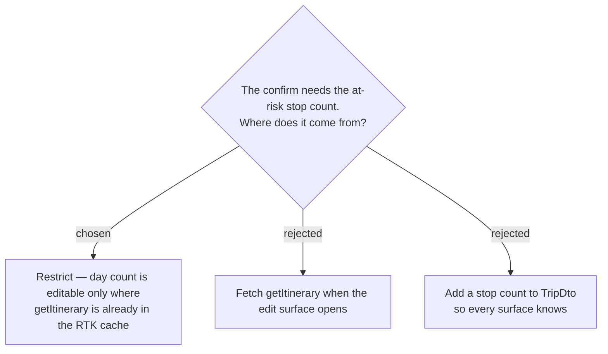

# ADR-139: The day-count control is live **only where the itinerary is already cached** — never fetch just to price the confirm

**Date:** 2026-08-01
**Status:** Accepted
**Relates to:** issue #50; decision-map `trip-crud-50`, ticket `shrink-data-loss`. Implements the precondition ADR-138 creates. Upholds ADR-042's no-gratuitous-refetch stance. Constrains the still-open `edit-surface` decision.

## Context

ADR-138 makes the at-risk stop count load-bearing: without it the surface cannot even decide **whether** to show the confirm, and defaulting the count to `0` would be silent destruction wearing a confirm's clothes.

`TripDetailPage` already holds everything needed. It calls `useDayRoute(tripId)` unconditionally (`TripDetailPage.tsx:64-65`), which fires `getItinerary` (`useDayRoute.ts:75-78`); `ItineraryDayDto` carries the full per-day stops array **including `isVisited`** (`api.ts:535-536`, `TripDtos.cs:32-37`), and `listTripPlaces` is loaded alongside it for the names.

`TripsPage` holds nothing usable. `TripsPage.tsx:17` loads only `useListTripsQuery()`, whose `TripDto` is `Id, Name, Destination, StartDate, DayCount, DefaultTravelMode, IsDaily` — nothing below the trip row.

The tempting fix — fetch the itinerary when the edit form opens — is more expensive than it looks, and the codebase already says so at `api.ts:1462-1465`: *"NO `invalidatesTags`, so `getItinerary` never refetches (**a refetch re-bills the Google Routes API + re-fetches Weather**). … keyed by `{tripId,tz,lat,lng}` → **possibly several**."* Because the detail page's cache key carries the viewer's `lat`/`lng` from a geolocation callback, a dialog querying without them gets a **different key** — a second round trip, not a cache hit.

## Decision

- **The day-count control is only live where the itinerary is already in the RTK cache** — in practice, the trip's own page. Any other entry point into trip editing shows day count **read-only**, with a pointer to the trip.
- **No surface fires `getItinerary` in order to price a confirm.**
- **While the count is unknown, that one control is disabled** — and only that one. Name, destination, start date and travel mode stay editable throughout. This covers both the in-flight window and the refire that `TripDetailPage.tsx:38-51` triggers when geolocation resolves, as well as an outright fetch failure, which simply leaves day count uneditable. This matches `DailyToggle`, which already disables itself in flight (`DailyToggle.tsx:13,39`).
- **The disabled state must show its reason**, not read as broken.

### Rejected

- **Fetch on open (B)** — from a list surface this is a Routes + Weather round trip the user never asked for, cutting directly against ADR-042's reasoning; and it would not hit the detail page's cache entry anyway, because of the `lat`/`lng` key.
- **Count on `TripDto` (C)** — genuinely attractive (it would also enable a "5 วัน · 12 จุด" line on the trips list) but it is a backend change across six positional construction sites in an effort scoped as frontend-heavy. Not ruled out forever; ruled out for #50.
- **Defaulting an unknown count to zero** — the failure mode the whole ticket exists to prevent.
- **Blocking the entire edit surface until the itinerary loads** — punishes editing a trip's *name* with a wait for data unrelated to it, and a fetch failure would block all editing.

## Consequences

**A trips-list card action cannot change the day count.** Whatever `edit-surface` decides, either it lives on the trip page, or a list-side entry point omits day count and defers it to the trip page. The destination is still met — every create-dialog field remains changeable on an existing trip — but not from every surface.

This resolves the map's fog line *"whether the trips list needs per-trip day or stop counts from the API"*: **it does not**, for #50.

Deleting a trip is unaffected. `DeleteTripHandler.cs:21` is a soft delete that touches no days, stops, places or checklist entries, so the delete path needs no count and no cache precondition.
