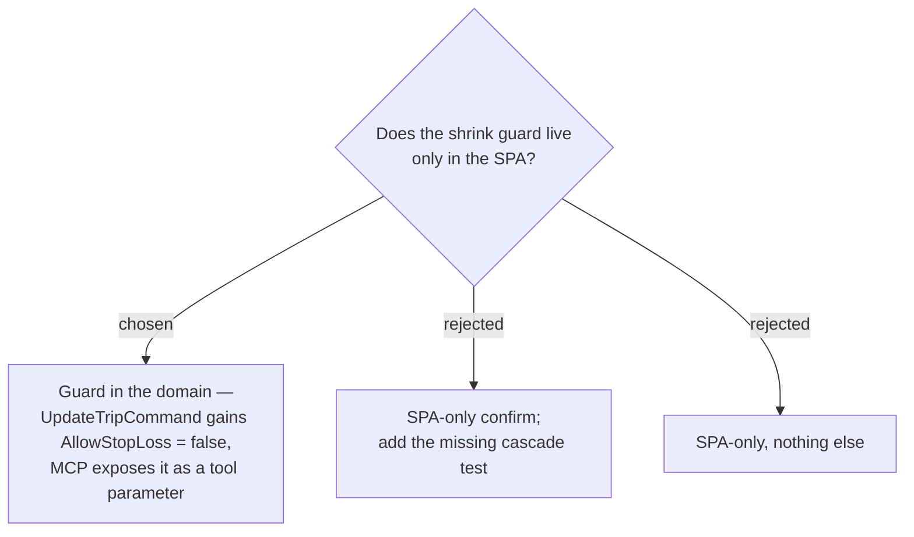

# ADR-140: `UpdateTrip` **refuses** a stop-destroying shrink unless `AllowStopLoss` is set — and MCP exposes the flag

**Date:** 2026-08-01
**Status:** Accepted
**Relates to:** issue #50; decision-map `trip-crud-50`, ticket `shrink-data-loss`. Server-side counterpart to ADR-138 (the SPA policy). Narrows ADR-009's "add/remove trailing days". Interacts with ADR-133.

## Context

Today there is **no server guard whatsoever**. `UpdateTripValidator` checks `TripId`, `Name` and `DayCount ∈ [1,60]` and nothing else, so any client can shrink a trip and cascade its stops away. `TripTools.cs` already warns about this **twice** — in the `update_trip` tool description (*"WARNING: lowering dayCount deletes the trailing itinerary days AND their stops (cascade)"*) and again on the `dayCount` parameter — but a description is not enforcement, and an agent is exactly the caller most likely to pass a plausible-looking smaller number.

There is also no test anywhere that seeds a `Stop` and then shrinks. `UpdateTripHandlerTests` and `UpdateTripHandlerRelationalTests` seed bare `ItineraryDay`s only; the five relational tests lock in date-realignment collision safety, not cascade behaviour. **The cascade is asserted by the schema and by nothing in CI.**

A UI-only confirm would leave both gaps exactly where they are.

## Decision

- **`UpdateTripCommand` gains a trailing `bool AllowStopLoss = false`.** As a defaulted **last** positional parameter, every existing construction site — `TripsController`, `TripTools`, and both test files — continues to compile unchanged. (ADR-137's "shifts every construction site" warning is about `TripDto`, which is *returned* from six places; it does not bite here.)
- **The handler refuses.** Before removing surplus days, it counts the stops on the days about to be dropped. If that count is greater than zero and `AllowStopLoss` is false, it throws a `DomainException` **naming the count and the day range** — an actionable message, not a bare rejection.
- **MCP exposes the flag.** `update_trip` gains an `allowStopLoss` parameter defaulting to `false`. An agent that shrinks destructively now fails once with a message telling it exactly what it would destroy, and may deliberately re-call with the flag set. This turns a description nobody enforces into a real two-step confirmation.
- **The SPA passes `allowStopLoss: true` only after the user confirms** per ADR-138. When no stops are at risk, the flag is irrelevant and the guard never fires.
- **Guarding requires testing the guard**, which necessarily seeds a `Stop` and shrinks — so the missing cascade coverage is closed as a by-product: a refusal case, and an `AllowStopLoss = true` case asserting the stops really do cascade away.

### Rejected

- **SPA-only (B, C)** — the destination forbids silently destroying scheduled stops, and the MCP path destroys them silently today. A guard only in the client we happen to be building defends nothing but that client's own bugs.
- **MCP hardcoding `true`** — keeps the agent path exactly as unguarded as it is now.
- **MCP never passing the flag** — an agent asked to "make this a 3-day trip" would have no supported path and would likely improvise something worse.

## Consequences

**This is a behaviour change to an existing endpoint**, not an addition: a shrink that succeeds today will start failing for callers that do not set the flag. That is the intent, and the only known callers are the SPA (which will set it) and MCP (which will surface it).

The refusal message is the *only* protection an MCP user gets — there is no modal there — so it must name the count and the days, not just say no.

Note the interaction with **ADR-133**: enabling daily mode on a multi-day trip is rejected with "remove the extra days first", which funnels the user straight into the destructive shrink this ADR now guards. That path is `daily-trip-editing`'s to resolve, not this one's.

Pure Application-layer change — no schema change, so **no EF migration** and none of CLAUDE.md's manual-migration ritual.
