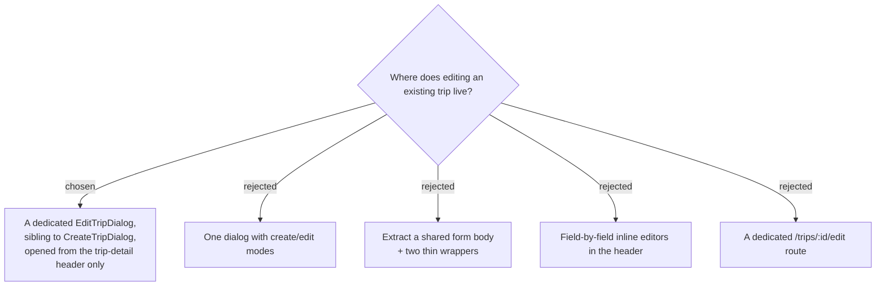

# ADR-141: The trip edit surface is a **dedicated `EditTripDialog`**, opened by an icon button in the trip-detail header

**Date:** 2026-08-01
**Status:** Accepted
**Relates to:** issue #50; decision-map `trip-crud-50`, ticket `edit-surface`. Consumes the constraints of ADR-138 (day count must be staged) and ADR-139 (the day-count control may only be live where the itinerary is cached). Follows ADR-137's separate-surface reasoning. Start date's second editor is ADR-142.

## Context

ADR-138 requires the day-count field to be **staged behind an explicit save**, which rules out the in-place commit-on-change idiom (`TripDateEditor`, `DayStartEditor`, `DailyToggle`) for this surface. `CreateTripDialog` already works exactly that way — its day stepper is a react-hook-form `Controller` calling `field.onChange` (`CreateTripDialog.tsx:238-263`), local state with an explicit submit — so the constraint is not a new pattern to invent, it is the pattern already in the repo.

But create and edit are **not the same form**. `CreateTripDialog` includes the `isDaily` switch (`:190-203`); ADR-137 forbids `IsDaily` on the full-replace `UpdateTrip`, and this map already ruled *"moving the daily on/off toggle into the edit surface"* out of scope. So the edit form must **drop** a field the create form has, on top of differing in title, submit label, defaults, mutation, success behaviour, and the entire day-count guard — seven divergences in a 327-line component.

ADR-139 separately decided that the day-count control may only be live where the itinerary is already cached. `TripsPage` loads only `useListTripsQuery()` (`TripsPage.tsx:17`), so a card-launched edit could never change the day count.

## Decision

- **A dedicated `EditTripDialog`**, a sibling component to `CreateTripDialog`, **not** a mode on it. It reuses the **`.create-trip-dialog` CSS class** so the two cannot drift visually — necessary because the Syncfusion `Dialog` is portaled to `document.body` and cannot see the page-scoped `.trips-page` / `.trip-detail` tokens, so each dialog family declares its own palette (`TripsPage.css:168-193`).
- **Fields:** name, destination, start date, day count, default travel mode. **No `isDaily` switch** — `DailyToggle` stays on the header (ADR-137, and out-of-scope on this map). The live end-date summary (`CreateTripDialog.tsx:89-95`) is reused, since seeing the new end date is most useful precisely when changing the day count.
- **Entry point: the trip-detail header only** — both the desktop `.trip-topbar` and the mobile `.trip-detail-header`. `TripsPage` is **not touched**; its card stays a single `<button>` that navigates, keeping `data-testid="trip-card"` where the Playwright e2e config expects it.
- **Affordance: an explicit inline-SVG pencil icon button**, not a tappable value.
- **Save is dirty-diffed** — if no field changed, the dialog closes without issuing the PUT, mirroring `StopEditorDialog.tsx:89-93`.
- **Cancel closes immediately with no dirty-state warning**, matching every other trips dialog. What is lost is typed text, not data.
- **Errors are local dialog state** rendered inside the dialog, and the dialog **stays open on failure**, closing only on success — `CreateTripDialog.tsx:110,308` and `StopEditorDialog.tsx:107`. Not the `onError`-to-parent idiom `TripDateEditor` uses.

### Rejected

- **One dialog with create/edit modes (B)** — seven forks threaded through a working 327-line component, where any mistake breaks trip creation, on a surface with no rendering tests to catch it.
- **Shared form body + wrappers (C)** — the cleanest long-term shape, but the largest diff and it refactors working create code for a second consumer that does not exist yet. Revisit if a third trip form ever appears.
- **Field-by-field inline editors (D)** — ADR-138 forbids it for day count, so this could only ever be a partial answer, and a form where one field behaves differently from its neighbours is worse than either consistent option.
- **A dedicated route (E)** — no precedent; every trips surface today is a dialog.
- **A trips-card entry point** — ADR-139 makes it a crippled edit (no day count), and the card is a single `<button>`, so a nested `<button>` would be invalid HTML that React does not warn about.

## Consequences

**You must open a trip before you can rename it.** Accepted: the alternative is an edit that silently cannot change one of its fields depending on where it was launched.

**Whether the trips card ever gains an action is left entirely to `delete-ux`**, which is the more likely place to want one. This ADR deliberately does not pre-empt it, and does no structural card work on speculation.

Two near-identical dialogs now exist. The shared CSS class is what holds them together; a field added to one should be considered for the other.

The pencil icon was chosen over ADR-012's "the value is the affordance" specifically because this is a **brand-new capability with zero existing discoverability**, and because a "visible editable treatment" on a plain value is exactly the kind of visual requirement that ships flat through gates blind to visual fidelity (as happened on #46). ADR-012 governs field-level editing, not a record-level action, so this is not a reversal of it.

Frontend-only. No new endpoint, no schema change, no migration.
