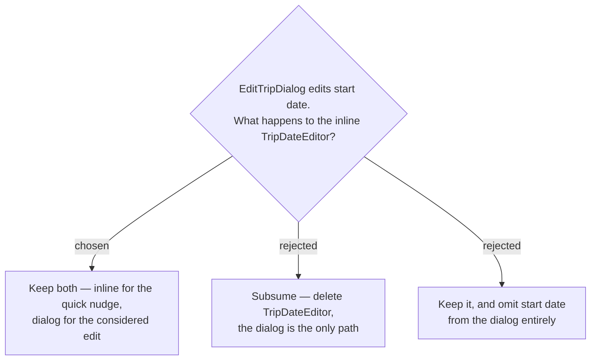

# ADR-142: Start date keeps **two** editors — `TripDateEditor` survives alongside `EditTripDialog`

**Date:** 2026-08-01
**Status:** Accepted
**Relates to:** issue #50; decision-map `trip-crud-50`, ticket `edit-surface`. Preserves ADR-012/013. Sibling to ADR-141. Verified safe against ADR-140's `AllowStopLoss` guard.
**Amended by ADR-146** — "needs no change" below was verified against ADR-140 only. ADR-146 adds a second domain guard on `Trip.StartDate`, which `TripDateEditor` *does* write, so it now takes `minDate={today}`. Everything else in this ADR stands.

## Context

`TripDateEditor` sits inline in both header variants (`TripDetailPage.tsx:139` desktop, `:203` mobile) and commits on change with no intermediate control, per ADR-012 and ADR-013. Nudging a trip's start date is the single most common trip edit, and it is currently one tap.

It is not trivial code. It carries the `locked` state for daily trips, the `overrideDate` projection for a current-time-start day, an optimistic local value with revert on failure, a StrictMode-safe `mounted` ref set inside the effect body (`:54-60`), and an `onError` callback to the parent.

It also deliberately sends the **whole trip** on every date pick (`:75-82`), carrying `dayCount` through unchanged — the comment at `:24-26` says why: *"Only the start date changes here … so no itinerary days are dropped (shrinking is out of scope)."*

## Decision

**Keep `TripDateEditor` exactly as it is, and also expose start date in `EditTripDialog`.** Start date is the one field with two editors; every other field has exactly one.

**This was verified safe against ADR-140.** Because `TripDateEditor` passes `dayCount` through unchanged, its PUT is never a **Shrink** — the new day count equals the old one, so the `AllowStopLoss` guard cannot fire and the component needs **no change**. It must **not** be given the flag.

### Rejected

- **Subsume (B)** — deletes working code that two ADRs deliberately produced, forces the `locked` and `overrideDate` logic to be reimplemented inside the dialog, and turns the most common trip edit from one tap into open → change → save.
- **Omit the date from the dialog (C)** — gives every field exactly one editor, but an "edit trip" dialog that cannot change the start date is confusing, and changing the date is most often wanted *together with* the day count, which lives in the dialog.

## Consequences

**Two surfaces write the same field, and they can disagree visually for a moment.** `TripDateEditor` holds an optimistic local value (`:73` set, `:86` revert) with a re-sync effect at `:64-66`; a save from the dialog invalidates `TripDetail`, so the inline editor re-syncs from the refetch rather than from the dialog directly. Verify interactively that the header date updates after a dialog save — the SPA has no rendering tests, so nothing automated will catch it if the re-sync misses.

Both paths hit the same full-replace `PUT /api/trips/{id}`, so there is no divergence in what reaches the server — only in what the user sees mid-flight.

The daily-trip case is **not** settled here: `TripDateEditor` is `locked` for a daily trip, but what `EditTripDialog` does with a daily trip's date and its permanently-pinned `dayCount = 1` belongs to the `daily-trip-editing` decision.
