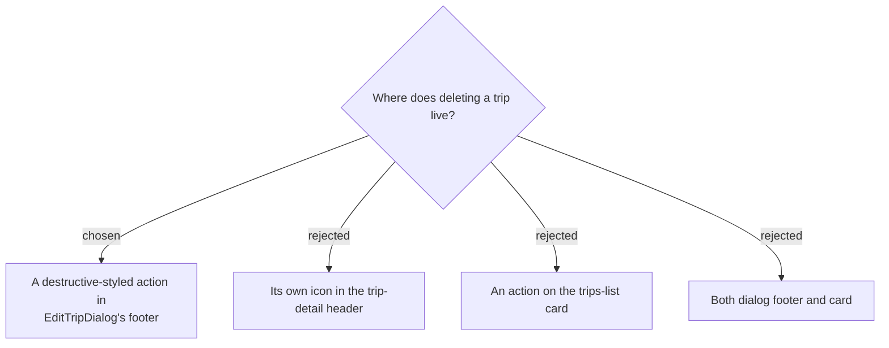

# ADR-143: Deleting a trip lives in **`EditTripDialog`'s footer**, confirms by naming the trip and its Discover consequence, and lands on `/trips`

**Date:** 2026-08-01
**Status:** Accepted
**Relates to:** issue #50; decision-map `trip-crud-50`, ticket `delete-ux`. Sits inside the surface ADR-141 created. Reuses the `useConfirm()` choice ADR-138 made. Deliberately breaks the `.se-delete` styling precedent. Completes the map's destination.

## Context

The endpoint and the hook already exist and are **completely unused** — `useDeleteTripMutation` has zero call sites in `frontend/src`. Nothing about this is a backend problem.

`DeleteTripHandler.cs` is a **pure soft delete**: `trip.SoftDelete()` sets `DeletedAt`, and nothing else is touched. Days, Stops, TripPlaces, checklist entries and Place profiles all survive, untouched, in the database. From the user's point of view deletion is final anyway — there is no undo, no trash bin and no restore endpoint, which this map already recorded as out of scope.

Both delete affordances that exist in trips today live in a **dialog footer**: `ลบจุดนี้` (`StopEditorDialog.tsx:203-218`) and `เอาออกจากทริปนี้` (`PlaceEditorDialog.tsx:139-142`). Both are styled deliberately *not* destructive — `.se-delete { color: var(--se-ink-soft) }` with only a hover tint (`TripDetailPage.css:535,550`), sitting far left opposite a large orange save.

`TripDetailPage` **already handles a deleted trip** (`:92-99`), rendering *"ไม่พบทริปนี้ — อาจถูกลบ หรือลิงก์ไม่ถูกต้อง"* — its comment says it covers a trip "that was deleted". Correct for a stale deep link, but if the user deletes a trip and stays put, that message reads as an error for something they just asked for.

## Decision

- **The delete action is a footer action of `EditTripDialog`** — matching both existing trips-delete affordances exactly. It requires no new header real estate, and putting an irreversible action one level deeper than the things you do daily is a feature, not a cost.
- **`TripsPage` is not touched.** Together with ADR-141 this means **#50 changes nothing on the trips list at all** — the card stays a single `<button>` that navigates, and never needs unwrapping.
- **Confirmation via the shared `useConfirm()`**, `destructive: true`, following the established copy convention (`title: 'ลบทริป'`, the trip name in `<strong>`, `confirmText: 'ลบ'`). It names three things:
  1. the **trip by name** — the highest-value element, because the real risk is deleting the wrong one;
  2. **"N วัน · M จุดแวะ"** — confirms identity at a glance. Counts are free: ADR-139 already requires this dialog to open where the itinerary is cached;
  3. the **Discover consequence** — this trip's places also disappear from **ไปไหนดี**, because `deleteTrip` invalidates `MyPlaces` (`api.ts:1373`) and `ListMyPlacesHandler` filters `t.DeletedAt == null`. Nobody would predict that from the words "ลบทริป".
- **The copy must not claim the stops are deleted.** They are not — say they *disappear from* the app, never that they are *erased*. The confirmation is the only safety net, so it has to be accurate as well as scary.
- **On success, navigate to `/trips`.** No toast: the trip's visible absence from the list is the feedback, and `CreateTripDialog` already establishes navigate-on-success (`TripsPage.tsx:92-95`).
- **The delete button reads as destructive**, breaking the muted `.se-delete` precedent (see below).
- **Errors** stay local dialog state with the dialog open, inherited from ADR-141. Unsaved edits in the form are simply discarded — delete supersedes them, and ADR-141 already decided cancel does not warn on dirty state.

### Rejected

- **Its own header icon (B)** — parks a permanently-visible, irreversible action next to things used constantly, and contradicts both existing delete affordances.
- **A trips-card action (C, D)** — the card is a single `<button>`, so an action inside it is invalid HTML; it would need restructuring to a `div` with a stretched link, reworking hover/active and preserving `data-testid="trip-card"` for the Playwright e2e config. Not worth it when the dialog already sits where every other trips delete lives.
- **A toast on `/trips`** — there is **no shared toast system**: `shared/components/` holds only `AppLayout`, `ConfirmProvider`, `FamilyRequiredRoute`, `HomeRedirect`, `NavBar`, `ProtectedRoute`. The only toast in the repo is `pages/budget/components/TransactionUndoToast.tsx`, feature-local *and* an undo toast, which this map ruled out of scope. Confirming what the user can already see is not worth new shared infrastructure.

## Consequences

**The delete button deliberately looks different from the two delete buttons beside it.** `.se-delete` is muted because removing a stop or a place is recoverable — you can add it back. Deleting a trip is not, in any way the user can act on. A muted control that raises a red `destructive: true` modal is an incoherence; the entry point should carry the same weight as the confirmation.

**To delete a trip you must first open "แก้ไข".** Accepted, and normal on mobile platforms. `edit-mock` should make the footer action visible enough that this is not a hunt.

Watch for a **flash of the not-found guard**: the delete invalidates `TripDetail`, and if a render lands between that invalidation and the navigation, `TripDetailPage:92-99` renders "ไม่พบทริปนี้" for a frame. The SPA has no rendering tests, so **verify this interactively** — it would ship looking like an error on a successful delete.

`useConfirm` has no pending state (`settle(true)` closes immediately), so the modal is gone while the DELETE is in flight. Acceptable here because success navigates away; the footer button carries the in-flight disable. It was also never verified that the provider's Dialog renders above `.itin-reorder-overlay` (`z-index: 1200`) — still unverified, still worth checking.

Frontend-only. No endpoint, schema, migration or MCP change.
