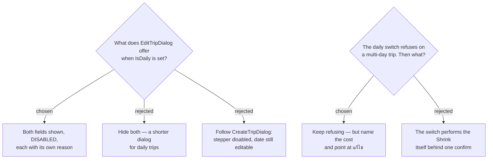

# ADR-144: On a daily trip the edit dialog **disables** วันเริ่ม and จำนวนวัน rather than hiding them — and the daily switch **names** the Shrink's cost instead of performing it

**Date:** 2026-08-01
**Status:** Accepted
**Relates to:** issue #50; decision-map `trip-crud-50`, ticket `daily-trip-editing`. Fills in the surface ADR-141 created for the one trip kind it did not cover. Constrained by ADR-132/133 (daily is single-day, guarded) and ADR-139 (where the day-count control may be live). Language of the backend messages it leans on: ADR-145.

## Context

Daily trips (#49) are in scope for editing, and ADR-141 gives them the same `EditTripDialog` as every other trip. The daily switch itself stays on the detail header — the map already ruled moving it into the form out of scope, and ADR-137 forbids `UpdateTrip` from carrying `IsDaily` at all.

Two of the five fields cannot mean anything on a daily trip, but for **different** reasons:

- **`dayCount` is pinned at 1 permanently.** `Trip.Reschedule` throws on `IsDaily && dayCount > 1` (`Trip.cs:64-65`) and `SetDaily` throws on `DayCount != 1` (`Trip.cs:73-74`). This is *impossible*, not merely *unknown* — a distinct case from ADR-139's "disabled while the at-risk count cannot be priced".
- **`startDate` is accepted by `Reschedule`, but is displayed nowhere.** `trip.startDate` is rendered at exactly **one** site in the whole SPA — `TripsPage.tsx:46`, inside `regularCard`. `dailyCard` has no date row at all; it shows a `วันนี้` line instead (`TripsPage.tsx:22-33`). In the detail header `TripDateEditor` is *always* locked on a daily trip (`currentDay = days.length === 1 && useCurrentTimeAsStart`, `TripDetailPage.tsx:99`; ADR-132 forces that day flag on), so it renders the server-projected `overrideDate` and is `disabled` (`TripDateEditor.tsx:95,109`). `GetItineraryHandler` projects the date to today and its own comment calls the persisted `Date` "the fallback".

So a start-date control on a daily trip would **save successfully and change nothing the user can see, anywhere**.

`CreateTripDialog` already contradicts itself here: with `isDaily` on it disables the stepper but leaves the `DatePicker` editable and submits the picked value (`CreateTripDialog.tsx:104,249-259`) — a value nobody will ever be shown.

Separately, ADR-133's daily-enable rejection reads *"ทริปประจำวันต้องเป็นวันเดียว — ลบวันอื่นก่อนถึงจะเปิดได้"* (`DailyToggle.tsx:16`, echoed verbatim by the MCP `set_trip_daily` description). "ลบวันอื่น" **is** a **Shrink** — the one irreversible destruction in MenuNest — and the message never says so.

## Decision

- **All five fields are always present.** On a daily trip วันเริ่ม and จำนวนวัน render **disabled, each with its own short reason**. The dialog has one shape for every trip.
- **วันเริ่ม displays today while disabled** — the same treatment `TripDateEditor` already applies when locked. Never the persisted value, which is a fallback no surface shows.
- **จำนวนวัน displays 1, disabled, and the reason says *daily trips are always a single day*** — deliberately different copy from ADR-139's "the count is not known here", because a user who just had the daily switch refused should find the explanation in the edit dialog.
- **`DailyToggle` keeps refusing** — non-destructive, exactly as ADR-133 requires — **but its message names the cost**: how many days the trip has now, that the stops on the removed days go with them, and that the change is made in แก้ไข. Built from `trip.dayCount`, already on `TripDto`; no new prop and no itinerary subscription, so ADR-139's cache rule is untouched.
- **The switch does not perform the Shrink.** The only path from multi-day to daily remains: shrink in the edit dialog (confirming the loss per ADR-138), then toggle.
- **The cross-surface race needs no new machinery.** `EditTripDialog` is `modal` like its `CreateTripDialog` sibling, so `DailyToggle` sits behind the overlay and cannot be reached from the same tab. A flip from another tab, another device or MCP lands on `Reschedule`'s domain guard, which ADR-141 already routes into the dialog's local error line with the dialog left open.

### Rejected

- **Hide both (B)** — the dialog would change shape between trips, branching both the code and the mock, and it would delete the only place the constraint is ever explained.
- **Follow `CreateTripDialog` (C)** — a control that saves successfully and changes nothing visible is worse than either showing it disabled or removing it. It is also the existing inconsistency, not a precedent worth extending.
- **The switch performs the Shrink behind one confirm (E)** — turns a header toggle into a destructive control, adds a second confirmation site for the same loss, and contradicts ADR-138's decision that a Shrink is staged behind an explicit save.
- **Naming the exact stop count in the toggle's message** — would require passing the itinerary into `DailyToggle` purely to compose a string. The day count plus "จุดแวะบนวันที่ลบจะหายไปด้วย" is enough to send the user to the surface that *does* count precisely.

## Consequences

**Create and edit now disagree about the daily start date**: create lets you pick one, edit does not. Defensible — at create the value is at least persisted as the fallback, and there is no existing trip to contradict — but it is a real divergence, and `edit-mock` must not quietly normalise the two. Whether `CreateTripDialog` should disable it too is a separate question, out of scope here.

**จำนวนวัน now has two disabled-with-reason states** — *count unknown* (ADR-139) and *daily* (this ADR). Same visual treatment, different copy; the mock has to show both or the implementer will build one and reuse its wording.

The message the user sees under the cross-surface race is `Trip.Reschedule`'s, which is **English** — see ADR-145, which decides that deliberately. `DailyToggle`'s own block message is authored in the SPA and stays Thai.

Frontend-only, apart from that message decision. No endpoint, schema, migration or MCP change.
