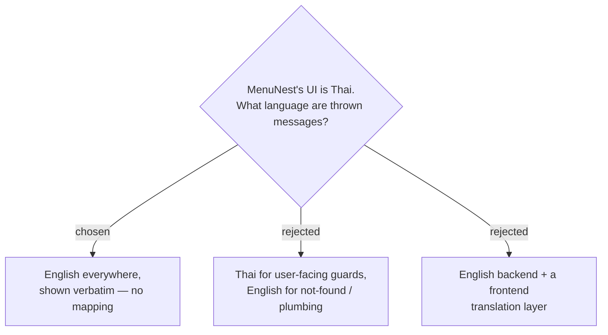

# ADR-145: Backend exception messages stay **English** — the SPA shows them verbatim, and there is no translation layer

**Date:** 2026-08-01
**Status:** Accepted
**Relates to:** issue #50; decision-map `trip-crud-50`, ticket `daily-trip-editing` (the question surfaced there, but the rule is repo-wide). Settles the language ADR-140 left unspecified. Applies to the guard ADR-144 relies on.

## Context

MenuNest's UI copy is Thai throughout. Its **error path is not**: `getErrorMessage` (`frontend/src/shared/utils/getErrorMessage.ts`) is a pure pass-through of ProblemDetails `errors` / `detail` / `title`, and its own fallback is English — *"Something went wrong. Please try again."*. Nothing in the SPA maps, matches or localises a backend string today.

Around **eighty** `DomainException` messages in `backend/src` are English. Exactly **four** are Thai, all of them in Trips, and all of them the same kind — *you tried something and were blocked*:

| Site | Message |
|---|---|
| `DeleteTripPlaceHandler.cs:27` | ลบไม่ได้ — สถานที่นี้ถูกจัดลงตารางแล้ว ลบจุดในแผนก่อน |
| `RetimeStopToHourHandler.cs:41` | ไม่สามารถเลื่อนไปวันที่ผ่านมาแล้ว |
| `RetimeStopToWeatherHandler.cs:62` | ไปถึงไม่ทัน |
| `RetimeStopToWeatherHandler.cs:80` | ไม่พบชั่วโมงที่เหมาะสมในช่วงพยากรณ์ |

That reads like an emerging convention — *user-facing guard → Thai, not-found / plumbing → English* — and #50 forced it into the open twice at once. **ADR-140** specifies a brand-new refusal message that must "name the count and the day range" and calls it *"the only protection an MCP user gets"*, but never says in which language; without a rule the SDD implementer simply picks one. And `Trip.Reschedule`'s daily guard — *"A daily trip must stay a single day. Turn off daily mode first."* — is reachable by a real user through `EditTripDialog` (ADR-144) while being English.

## Decision

- **Every message thrown from the backend is English** — `DomainException`, validation messages, all of it. There is no carve-out for user-facing guards.
- **No translation layer.** `getErrorMessage` keeps passing `detail` through verbatim. The SPA never maps or matches a backend string.
- **`Trip.Reschedule` keeps its message unchanged**, and **ADR-140's refusal message is English** — still obliged to name the stop count and the day range, which is what makes it actionable in either language.
- **The line is where the string is authored, not who reads it.** Copy written in the SPA stays Thai — `DailyToggle`'s block message (ADR-144) is composed in the frontend and is unaffected by this rule.
- **The four Thai messages above are a known deviation.** #50 does not retrofit them.

### Rejected

- **Thai for user-facing guards (B)** — the tidier story for a Thai-speaking user, but it puts Thai UI copy in the **Domain** layer, and it makes "is this message user-facing?" a judgement call to be re-litigated at every new throw site. ADR-140's message is the proof: it is read by an MCP agent *and*, on a stale itinerary cache, by a person.
- **English backend + frontend translation (C)** — the honest way to get Thai in front of the user, and rejected only on cost: no mechanism exists. It needs an error-code contract in ProblemDetails (string matching would be brittle and would break on any copy edit), the four Thai messages retrofitted into codes, and a catalogue to maintain. That is new cross-cutting infrastructure, far past #50.

## Consequences

**A Thai-speaking user will sometimes read an English sentence** — in `EditTripDialog`'s error line, in the trip header's shared error line, and anywhere else a throw surfaces. This is accepted deliberately, and it is already true of every failure in the app today, including `getErrorMessage`'s own fallback.

Because the messages are not localised, they have to carry their weight as **information**: ADR-140's refusal naming the count and the days matters more under this decision, not less.

The four Thai messages stay until someone chooses to normalise them. A reader who finds one should treat it as a deviation, **not** as precedent for a new throw site.

Nothing to build. This ADR removes a decision from the implementer rather than adding work.
