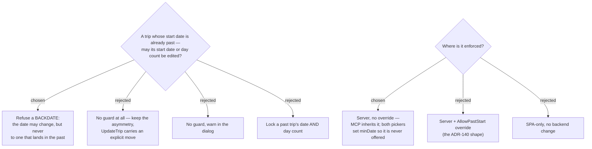

# ADR-146: `UpdateTrip` refuses a **Backdate** — and both start-date pickers stop offering one

**Date:** 2026-08-01
**Status:** Accepted
**Relates to:** issue #50; decision-map `trip-crud-50`, ticket `past-dated-trip-edits`. Closes the last decision blocking `edit-mock`. Mirrors the guard in `RetimeStopToHourHandler.cs:36-41`. **Amends ADR-142.** Second guard on the command ADR-140 extends; refusal language per ADR-145. Introduces **Backdate** to CONTEXT.md.

## Context

`UpdateTripHandler` has **no past-date guard**. `RetimeStopToHourHandler` — the only other writer of `Trip.StartDate`, reusing the same `DayRealigner` — has one (`:40-41`). ADR-140 established that `UpdateTrip` can carry domain guards, so the asymmetry became a live choice.

Three findings shaped the answer, and two of them argue *against* guarding:

**Creating a past-dated trip is already frictionless.** `CreateTripValidator` checks only `Name` and `DayCount ∈ [1,60]`; `CreateTripDialog.tsx:220-224` renders its `DatePicker` with no bound. A trip starting January 2020 is three taps away.

**Retime's guard is about *silence*, not about past dates.** Its own comment says so: retiming is an **implicit** date move — the user picks an *hour* on a forecast strip, and "a cross-day pick anchored to 'now' can resolve to a large negative delta and **silently** shift StartDate + earlier days into the past." It defends a non-date control from moving a date. In `EditTripDialog` the user aims a date picker at a date.

**A naive port of that guard would break renaming a past trip.** `UpdateTrip` is a full replace: every save re-sends `StartDate`. A rule reading *"refuse if `c.StartDate` is past"* fires when you edit only the **name** of last month's trip, and fires on the day-count field too — making a past trip unmaintainable. Only a *changed*-date check can work.

The "silent degradation" the ticket raised does not survive inspection as a reason to guard. Moving a trip **forward** past 240h flips on-arrival weather to No-data exactly as moving it backward does (`weather.ts:9-11` — `'beyond'` and `'past'` are gated out by the same branch in `useStopWeather.ts:53-55`). Weather loss is a **horizon** effect, symmetric on both sides. Season and opening-hours changes are not degradation at all; they are the correct answer to a new date.

The guard was nonetheless chosen, for **consistency between the two writers of `Trip.StartDate`**: one past-date semantic in the codebase rather than two.

## Decision

- **A `Backdate` is refused.** `UpdateTripHandler` throws a `DomainException` when the start date **changes** *and* the new value lands in the past. An unchanged start date is always allowed, so renaming, re-destinating, re-moding and re-counting a past-dated trip all keep working.
- **What is governed is where the date lands, never which direction it moved.** `14 Nov → 12 Nov` is not a Backdate while both are ahead. This is the semantic CONTEXT.md now pins, and it is what keeps `UpdateTripHandlerRelationalTests`' "shift backward" case (`:95-101`) valid.
- **The floor is `DateOnly.FromDateTime(_clock.UtcNow).AddDays(-1)` — identical to Retime, comment and all.** The one-day slack is deliberate timezone tolerance, not an off-by-one, and the guard must carry a comment saying so the way `RetimeStopToHourHandler.cs:36-39` does. MenuNest is Thai-first (UTC+7, never affected) but it is a *travel* app: a user physically in a UTC-negative timezone has a legitimate local "today" that is still UTC-yesterday.
- **Server-side, with no override.** No `AllowPastStart` flag, no new MCP parameter — an exact mirror of Retime, which has none either. MCP's `update_trip` inherits the refusal; its `startDate` `[Description]` should say so, since the message is the only protection an agent gets.
- **Both pickers set `minDate={today}`** — `EditTripDialog`'s *and* `TripDateEditor`'s — so a Backdate is never offered and the server guard is a backstop nobody normally reaches. `minDate` (inherited from `CalendarBaseProps`, **not** `min`) gates selectability: `datepicker.js:41` returns `false` from the selectable check for out-of-range dates. Leave `strictMode` at its default `false` — enabled, it "auto-corrects" invalid values, which on a past trip would rewrite the displayed start date.
- **Day count carries no past-specific restriction.** On a past trip it grows freely and shrinks behind ADR-138's confirm, which already names any already-**Visited** stops — the real harm is guarded at the point it occurs, not by proxy through a date property.
- **The edit surface shows nothing past-specific.** No disabled-with-a-reason treatment, no banner. `minDate` does all the work.

### Rejected

- **No guard at all (B)** — what the evidence above actually supports, and it would have kept edit at least as capable as create. Rejected in favour of one consistent past-date semantic across both `StartDate` writers.
- **No guard, warn in the dialog (C)** — the warning's premise (weather degrades) is false as a past-specific claim, so the copy would be teaching the user something untrue.
- **Lock a past trip's date and day count (D)** — treats a past trip as a record, but nothing else in the app does: `ListTripsHandler` sorts `OrderByDescending(StartDate)` and past trips simply sink down the same list forever, with no archive, no completed state and no dimming. It also contradicts the destination's *"every field the create dialog collects can be changed on an existing trip"*, and would give `จำนวนวัน` a **third** disabled-with-reason state on top of ADR-139's and ADR-144's.
- **An `AllowPastStart` override (F)** — the ADR-140 shape, and it would preserve an escape hatch for a trip mis-dated into the past. Rejected as a second boolean, a second confirm site, and a fresh asymmetry with the very handler this ADR exists to match. The trap it would solve is narrow: a past-dated trip can always be rescued *forward*; only re-placing it at a different past date becomes impossible.
- **SPA-only (G)** — leaves MCP able to move any trip into the past, defending only the client we happen to be building. The reasoning ADR-140 already rejected.
- **`minDate` in the dialog only** — smallest diff and ADR-142 would stay literally true, but it makes the inline header editor the one surface offering a pick the server always refuses, and it is the more frequently used of the two.
- **Client-supplied viewer date** — the floor would exactly match the picker, but a caller supplying the value the guard checks can defeat it by lying.

## Consequences

**ADR-142 is amended.** Its claim that `TripDateEditor` "needs **no** change" was verified only against ADR-140's `AllowStopLoss`; a date guard is precisely what invalidates it. `TripDateEditor` now takes `minDate={today}`. Its existing `onError` + optimistic-revert path (`:73`, `:86-88`) still handles a refusal that slips through, so the amendment is one prop.

**Create and edit now disagree about past dates** — create accepts one, edit refuses it. This is the *same* divergence ADR-144 already recorded for the daily start date, and it is left standing for the same reason: #50's destination is editing and deleting an existing trip, not correcting `CreateTripDialog`. It does mean a determined user can still produce a past-dated trip. That is acceptable — this guard prevents accidents, it does not enforce an invariant.

**`UpdateTripHandler` gains an `IClock` dependency.** Two `Build` helpers change: `UpdateTripHandlerTests.cs:14-15` can use `HandlerTestFixture.Clock` (already exposed, fixed at 2026-01-01); `UpdateTripHandlerRelationalTests.cs:55` builds the handler bare and needs its own `FixedClock`. **Never wire the system clock into these tests** — every date in both files is a hardcoded `2026-11-x` / `2026-12-x`, so a real clock turns the whole suite into a time bomb that detonates in December 2026.

**`minDate` on a Syncfusion picker is unproven in this repo** — every existing `min=` is a plain number input. Two things must be verified interactively before push, because CLAUDE.md's "no rendering harness" means nothing automated will catch either: (1) a **past** trip's own out-of-range value still *displays* in the field rather than blanking, and (2) it does not fire an `onChange` that the ADR-141 dirty-diff would read as an edit — that would silently move the trip to today, a forward move the server happily accepts. If either fails, drop `minDate` from that picker and fall back to the server guard plus the dialog's local error line.

**The refusal message is English**, per ADR-145. Acceptable precisely because `minDate` means a user should never see it; if the interactive verification above forces the fallback, that trade-off is worth revisiting.

Application layer plus two frontend props. No schema change, **no EF migration**, and none of CLAUDE.md's manual-migration ritual. Like ADR-140 this is a behaviour change to an existing endpoint: a Backdate that succeeds today starts failing.
