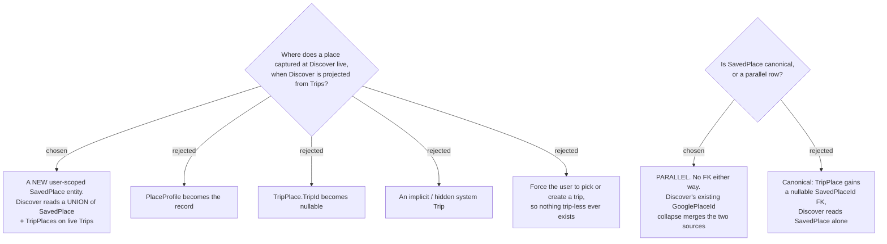

# ADR-147: A Discover-captured place lives in a new user-scoped **Saved place**, merged into Discover alongside trip Places

**Date:** 2026-08-04
**Status:** **Superseded by [ADR-155](155-a-discover-capture-must-attach-to-a-trip.md)** (2026-08-11) — the owner reversed this decision on ticket #54, which was reopened and re-decided: a Discover capture must attach to a **Trip**, so `SavedPlace` is not built. Rejected option **E** below is now the chosen path. This ADR is kept as the record of what was believed on 2026-08-04 and of the four other options weighed; every mechanism it decides (the entity, the union, the `sp:`/`tp:` keys, the migration, the survives-trip-deletion guarantee) is void.
**Relates to:** issue #48; decision-map `discover-add-place-48` (#53), ticket `place-home` (#54). Unblocks `coordinate-places` (#55), `duplicate-policy` (#61), `shared-capture` (#60), `mcp-surface` (#63). Consumes the measurements in ticket `plus-code-resolution` (#57). Extends the user-scoped-master pattern of ADR-063/065. Amends the CONTEXT.md definitions of **Capture**, **Place** and **Discover**; introduces **Saved place**.

## Context

`ListMyPlacesHandler` builds Discover **entirely** from `TripPlaces` inner-joined to Trips
(`:25-29`), filtered `t.UserId == user.Id && t.DeletedAt == null`, then grouped by
`GooglePlaceId ?? $"tp:{Id}"` (`:41`) with a representative picked by newest
`UpdatedAt ?? CreatedAt` (`:54`). A place therefore **exists only because it sits on a trip**.
Issue #48 asks for capture from inside Discover, where there is no trip — so the read model has
no row to return and the domain has no place to put one.

Three invariants closed off the options that looked cheapest:

**`PlaceProfile` cannot be the record.** `PlaceProfile.Create` **throws** on a blank
`GooglePlaceId` (`:33`), its unique key is `(UserId, GooglePlaceId)` (ADR-063), and it carries
**no identity fields at all** — no name, coordinates, address, category or photo, only
enrichment. Making it the record means relaxing the key *and* adding the identity of a place to
a type whose CONTEXT.md definition explicitly says it "holds no per-trip state" and exists to be
the enrichment master. That is not an extension, it is a different entity wearing the same name.

**`TripPlace` cannot be trip-less without a lie.** `TripPlace.Create` hard-requires a non-empty
`TripId` (`:44`), and the type's own summary calls it "a saved candidate location in **a Trip's**
pool".

**The glossary has no word for a place outside a trip.** All three relevant terms contradict
#48's destination: **Capture** is *"bringing a Place into **a Trip** from Google Maps"*, **Place**
is *"anchored to a Google `place_id`"*, and **Discover** *"surfaces the User's own saved Places
across **all** their **Trips**"*. This was the decisive signal that #48 needs a **new concept**,
not a new column.

One measured fact from #57 shaped the dedupe answer rather than the home: the same physical place
captured once from a URL and once from a Plus Code receives **two different Google ids** — a
`ChIJ…` POI id and a `plus_code`-typed `GhIJ…` id naming a ~14 m square. `GooglePlaceId` equality
therefore cannot detect that pair as one place.

## Decision

- **A new user-scoped `SavedPlace` entity is the home.** It carries the place's own identity —
  `UserId`, nullable `GooglePlaceId`, `Name`, `Lat`, `Lng`, `Address`, `Category`, `PriceLevel`,
  `PhotoUrl`, `OpeningHoursJson` — mirroring `TripPlace`'s snapshot shape minus everything
  per-trip. `GooglePlaceId` is **nullable**, which is what lets a coordinate or Plus Code capture
  exist at all.
- **It is a parallel row, not a canonical one.** There is **no FK in either direction** between
  `SavedPlace` and `TripPlace`. Adding a saved place to a trip writes a `TripPlace` snapshot
  exactly as trip capture does today; the `SavedPlace` row stays put.
- **Discover reads a UNION of the two sources**, grouped by
  `GooglePlaceId ?? "sp:{id}" | "tp:{id}"` — the *existing* collapse mechanism, unchanged in
  shape. Two rows sharing a `GooglePlaceId` therefore merge into **one** Discover card for free,
  and the representative is still the newest by `UpdatedAt ?? CreatedAt`, with `SavedPlace`
  participating in that same rule.
- **What `ListMyPlaces` returns for a trip-less place:** the full `DiscoverPlaceDto` with
  **`trips: []`**, **`visited: false`** (Stops reference `TripPlaceId` only, so a `SavedPlace` can
  never be Visited), and enrichment (`ReviewLinks`, `Notes`, best-time, season) resolved from
  `PlaceProfile` **only when it has a `GooglePlaceId`** — a coordinate capture gets none, because
  the profile is keyed on that id.
- **Its dedupe key is `GooglePlaceId` when present, and its own row id otherwise.** Two captures
  of the same `place_id` collapse regardless of which surface made them. Two captures of the same
  *coordinate* do **not** — they are two cards. That is a known, accepted gap here and is
  `duplicate-policy` (#61)'s decision to close, informed by #57's two-different-ids finding.
- **When a trip the place was later added to is deleted, the place survives in Discover.** The
  soft-deleted trip drops its `TripPlace` out of the union; the `SavedPlace` row has no FK to the
  trip and is untouched, so the card remains and only its `trips[]` chip disappears. This is
  deliberately the same survival guarantee ADR-065 gives `PlaceProfile`.
- **No delete or edit surface is added.** Place CRUD from Discover is out of scope on this map,
  so `SavedPlace` needs no `DeletedAt` and no soft-delete semantics yet.

### Rejected

- **`PlaceProfile` becomes the record (B)** — zero new tables and it is *already* the
  user-scoped, cross-trip, survives-trip-removal record, which makes it superficially the obvious
  answer. Rejected because its `(UserId, GooglePlaceId)` unique key cannot accept a coordinate
  capture and its `Create` guard forbids one outright; carrying place identity would also
  contradict its own definition as pure enrichment, and every existing `PlaceProfile` consumer
  would start seeing rows that are not enrichment.
- **`TripPlace.TripId` becomes nullable (C)** — the smallest schema change, and the dedupe key
  would not move at all. Rejected because it makes the type's name false for trip-less rows and,
  worse, silently changes the meaning of **every existing query that joins Trips**: an inner join
  quietly excludes the new rows, so each call site becomes a correctness question rather than a
  compile error. That is exactly the failure mode #23 produced when a shared shape changed.
- **An implicit / hidden system Trip (D)** — genuinely zero migration and `ListMyPlaces` would
  work untouched, which is a real attraction. Rejected for how many places the hiding leaks: the
  trip would surface as a `trips[]` chip on the very cards it exists to serve, it must be filtered
  out of the trip list, `IsDaily` and `DayCount` have no meaning for it, it needs an
  `ItineraryDay` it will never use, and a soft-delete of it would silently empty the user's whole
  library.
- **Force the user to pick or create a trip (E)** — honest, no new machinery, and it matches how
  a user planning a specific journey already thinks. Rejected because it re-opens the precise gap
  Discover was built to close: CONTEXT.md says Discover "closes the gap that Places are otherwise
  reachable only inside one Trip", and demanding a trip at capture time puts that gap back at the
  moment of capture.
- **`SavedPlace` canonical, `TripPlace` pointing at it (G)** — one source for Discover, no union,
  no dual-source dedupe; the cleaner model on paper. Rejected because **every existing
  `TripPlace` would have to be backfilled into a `SavedPlace` or disappear from Discover**, which
  turns a modelling decision into a data migration and activates the map's still-open
  migration/backfill fog line. The parallel shape is purely additive: no existing write path
  changes and no existing row has to move.

## Consequences

**A new `DbSet<SavedPlace>` must be added to all three `IApplicationDbContext` implementers** —
`AppDbContext`, `SqliteAppDbContext` and `InMemoryAppDbContext` — or the build fails `CS0535`
(CLAUDE.md). The entity **and** its EF configuration must land in the **same commit**: an
unmapped entity fails EF model validation for every test that touches the context, so an
"entity now, mapping next" split can never pass the pre-commit hook.

**This adds an EF migration, and migrations are applied to prod BY HAND.** Neither the app nor
the CD pipeline runs them. Shipping the code without applying the migration produces
`Invalid object name 'SavedPlaces'` — a 500 that the SPA renders as "An unexpected error
occurred." across all of Discover. Issue #49 already caused exactly this outage by skipping the
step.

**`ListMyPlaces` stops being a single query.** It becomes two reads plus an in-memory union, and
its early return `if (rows.Count == 0)` (`:31`) is now **wrong** — a user with no trips but with
saved places would get an empty Discover. That line must become a check on the *combined* set.
`ListMyPlacesHandlerTests` needs cases for: saved-place-only, both-sources-same-`GooglePlaceId`
(expect **one** card), and trip-deleted-but-saved-place-survives.

**An empty `trips[]` is now a reachable state in the SPA**, where before it was impossible. The
category filter, the four Discovery signals, the Visited toggle and the `trips[]` chips were all
written assuming a place arrived via a trip. This decision is what makes that fog line
answerable, and it is graduated to its own ticket rather than settled here — note that the SPA
has **no** component or visual test harness, so nothing automated will catch a broken render of
a chip-less card.

**Trip-captured places still vanish from Discover when their trip is soft-deleted.** This ADR
does not change that; `t.DeletedAt == null` still gates the trip-sourced half of the union. The
asymmetry is now explicit and visible — Discover-captured places survive, trip-captured ones do
not — and whether trip capture should also write a `SavedPlace` is `shared-capture` (#60)'s
question, not this one.

**Enrichment is unreachable for a place with no `place_id`.** `PlaceProfile` is keyed on
`GooglePlaceId`, so a coordinate or Plus Code capture can carry no note, review link, best-time
window or checklist. Whether that key changes is `coordinate-places` (#55)'s decision; #57
established that a Plus Code capture *can* obtain a `plus_code`-typed id that would satisfy the
key while pointing at a 14 m square rather than a place, so satisfying it is not automatically
the right move.

Domain + application + persistence, one new entity, one migration. No change to any existing
write path.
