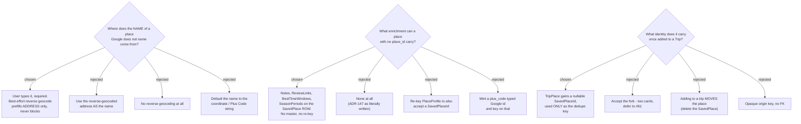

# ADR-148: A coordinate place is **user-named**, carries its enrichment **on its own row**, and keeps one identity across trips via a dedupe-only `SavedPlaceId`

**Date:** 2026-08-07
**Status:** **Partially superseded by [ADR-155](155-a-discover-capture-must-attach-to-a-trip.md)** (2026-08-11) — ADR-147 was reversed, so `SavedPlace` is not built and the **dedupe-only `SavedPlaceId`** named in this ADR's title has nothing to point at. **Void:** that mechanism, and with it the guarantee that one coordinate place keeps one identity across two Trips (re-opened as `coordinate-places` #55 / `duplicate-policy` #61). **Still stands:** a coordinate capture is **user-named**, and a `place_id`-less place carries its note, review links, best-time windows and season periods **on its own row** — which under ADR-155 is its `TripPlace` row, already served by `ListMyPlacesHandler:62-65`'s fallback to the representative `TripPlace`.
**Relates to:** issue #48; decision-map `discover-add-place-48` (#53), ticket `coordinate-places` (#55). Consumes the measurements in `geocoding-cost` (#58) and `plus-code-resolution` (#57). **Amends ADR-147** (narrows its "no FK either way" wording, and reverses its "a coordinate capture gets no enrichment" consequence). **Reaffirms ADR-066**'s cut of non-`place_id` places from the `PlaceProfile` library. Unblocks `duplicate-policy` (#61). Amends the CONTEXT.md definition of **Saved place**.

## Context

ADR-147 gave a Discover capture a home — a user-scoped `SavedPlace` with a **nullable**
`GooglePlaceId`, which is what lets a lat/lng or Plus Code capture exist at all. It then handed
three questions here, and the code answers some of them before anyone has to decide.

**Already settled by the code, not by this ADR.** `TripPlace.Create` throws on a blank name
(`:44`), so a **name is required** and always has been; `Address` is nullable, so an **address is
already optional**. Everything computed from lat/lng works untouched for a `place_id`-less place —
weather and the hourly forecast, distance, the map pin, Discovery scope, and navigation, because
`navUrl.ts:70` encodes "lat,lng only (no place_ids)". What is lost is exactly what the Places API
would have supplied — photo, price level, opening hours — plus anything keyed on `place_id`.

**`SavedPlace` is not built yet.** ADR-147 is accepted but unimplemented (no `SavedPlace` symbol
exists anywhere in `backend/src`), so the entity's shape is still free to choose. It will not be
free after the migration ships, and migrations here are applied to prod **by hand**.

Three measured facts shaped the answers:

**Reverse geocoding returns an address, not a name.** It can prefill `Address` and *suggest* a
name; it can never *be* one. A coordinate capture is by definition a point Google declines to
name — a viewpoint, a roadside stall, a spot in a chat message — so the user is the only authority
on what it is.

**Cost is not a constraint, but availability might be.** #58 measured Geocoding at **$5/1,000 with
10,000 free calls/month** — the cheapest SKU in play by 4x-7x, and ~333 captures/day before it
bills at all, against the **1,000/month** free cap on the Text Search Enterprise and Place Details
Enterprise SKUs the existing capture paths burn. Cost therefore argues *for* reverse geocoding. But
#58 also found the repo calls **no Geocoding endpoint anywhere today**, so whether that API is even
enabled on the key is unknown and unreadable from this machine — and #65 means an API-restriction
403 would surface as a generic failure rather than naming itself.

**`PlaceProfile` cannot hold a coordinate place, and would not earn its keep if it could.**
`Create` throws on a blank `GooglePlaceId` (`:33`) and the unique key is `(UserId, GooglePlaceId)`
(ADR-063). More decisively: a master exists to survive across **N** `TripPlace` snapshots of one
Google place. A coordinate place has exactly **one** row, so a master for it would be 1:1 with that
row and do no work at all.

## Decision

### 1. The name is typed by the user; reverse geocoding is best-effort and address-only

- **`Name` is a required field on the capture form** for the lat/lng and Plus Code inputs, exactly
  as it is required by `TripPlace.Create` today.
- On entering a coordinate, the client makes **one best-effort reverse-geocode call** and uses the
  result to **prefill `Address`**, and to offer that address as a *suggested* name the user may
  accept or overwrite.
- **The lookup never blocks capture.** If Geocoding is disabled on the key, restricted, rate-capped
  or simply fails, the capture still succeeds with a user-typed name and a null address. This is
  deliberate: it removes the one live-account unknown #58 could not resolve from the critical path.
- `Address` stays **optional**, as the schema already has it.

### 2. Enrichment lives on the `SavedPlace` row; `PlaceProfile` is not touched

- `SavedPlace` carries **`Notes`, `ReviewLinks`, `BestTimeWindows` and `SeasonPeriods` directly** —
  the same value-object backing lists `TripPlace` already owns, with the same caps (10 review
  links, 6 best-time windows, 12 season periods).
- **`PlaceProfile` keeps its `(UserId, GooglePlaceId)` key and its `Create` guard unchanged.**
  ADR-066's cut stands: a place with no `place_id` gets **no master**, and every
  `PlaceProfileSync` method keeps its existing no-op behaviour for it.
- A `place_id`-bearing `SavedPlace` still resolves enrichment from its `PlaceProfile` master when
  one exists, exactly as ADR-147 specified. The row-level lists are the **only** source for a
  `place_id`-less place, and the **fallback** for one whose master is absent — mirroring the
  fallback `ListMyPlacesHandler` already applies to `TripPlace` (`:64-66`).

### 3. One identity across trips, via a dedupe-only `SavedPlaceId`

- **`TripPlace` gains a nullable `SavedPlaceId`**, set when — and only when — a `TripPlace` is
  created by adding an existing `SavedPlace` to a trip.
- Discover's group-by becomes
  **`GooglePlaceId ?? "sp:{SavedPlaceId}" ?? "sp:{own id}" | "tp:{own id}"`**.
- The column is a **dedupe key, not a relationship**. `SavedPlace` does not become canonical,
  Discover still reads a union of both sources, no existing write path changes, and every existing
  `TripPlace` row takes `null`.

### 4. What degrades, what is hidden, what is refused

| | Behaviour for a `place_id`-less place |
|---|---|
| Weather, hourly forecast, navigation, distance, map pin, Discovery scope | **Work fully** — all computed from lat/lng |
| Name, category, review links, note, best-time, season | **Work fully** — user-supplied at capture, stored on the row |
| Address | Prefilled best-effort; **optional**, may stay null |
| Photo, price level, opening hours | **Null** — the Places API was never called |
| Open-now Discovery signal | **Degrades, does not hide.** Unknown-hours places are **kept** when the toggle is on — the existing, deliberate behaviour proven by `discoverFilter.test.ts:30`. A place is not hidden because its hours are unknown |
| Visited | `false` for a `SavedPlace` (Stops reference `TripPlaceId`); **works normally** once added to a trip |
| **Push to master** | **Hidden in the SPA.** The server-side `DomainException` in `PlaceProfileSync.UpsertFromAsync` stays as the backstop for MCP callers |

Only **push to master** is hidden. Everything else either works or degrades visibly; nothing else
is suppressed, because suppressing an affordance on the already-most-degraded place type teaches
the user less than showing it inert.

### Rejected

**Name — the reverse-geocoded address as the name (B1).** Zero typing. Rejected because every
coordinate place would then read as `123 ถนนสุขุมวิท` in Discover for a place the user thinks of
as `ร้านลุงหนวด` — which is precisely the identity failure this ticket exists to prevent — and it
hard-depends on Geocoding being enabled, the one thing #58 could not confirm.

**Name — no reverse geocoding at all (C1).** $0, no new API surface, no dependency on the key's
restrictions. Genuinely tempting given that availability is unverified. Rejected because the
best-effort framing already neutralises that risk, and 10,000 free calls/month is real headroom to
leave unused for a field the user would otherwise type by hand.

**Name — default to the coordinate or Plus Code string (D1).** Never blocks, never calls Google.
Rejected because users do not go back and rename: the library fills with `13.7563, 100.5018` cards,
and an unreadable library is worse than a required field.

**Enrichment — none at all (B2), ADR-147 as literally written.** The smallest `SavedPlace`, and
consistent with ADR-066's cut and the habit of deferring extras. Rejected because it refuses a
personal note and a review link on exactly the places Google cannot describe — the ones where the
user's own words are the *only* description that will ever exist — and because adding the lists
later costs a second hand-applied migration for an entity that is not built yet.

**Enrichment — re-key `PlaceProfile` to accept a `SavedPlaceId` (C2).** Uniform model, one
enrichment path, no duplicated value-object lists. Rejected because it relaxes a key ADR-063 chose
deliberately, changes a `Create` guard, and makes every existing `PlaceProfile` consumer start
seeing rows keyed a second way — all to build a master that can only ever have one member.

**Enrichment — mint a `plus_code`-typed Google id and key on that (D2).** #57 proved this id is
obtainable and it satisfies the existing key with **no schema change at all**, which makes it the
cheapest option on paper. Rejected on three counts: it names a ~14 m square rather than a place; it
**differs from the `ChIJ…` id** the same physical place gets from a URL, so it permanently forks one
place into two cards that can never merge; and it costs $0.020 a capture from the 1,000/month Place
Details Enterprise cap (#58). It also does nothing for a plain lat/lng, which has no Plus Code to
resolve.

**Identity — accept the fork, defer to #61 (B3).** Zero schema change beyond ADR-147, and that ADR
already declared the two-captures gap accepted. Rejected because #61's question is *"are these two
captures the same place?"* — a genuinely hard matching problem — whereas this is a link **the system
itself created** and already holds in hand at add-time. Deferring it would hand #61 a problem that
did not need to be hard, and ship a visible duplicate in the meantime.

**Identity — adding to a trip MOVES the place (C3).** One card always, no new column. Rejected
because it destroys the survival guarantee ADR-147 chose `SavedPlace` to provide: delete the trip
and the place vanishes entirely. It also makes "add to trip" silently destructive.

**Identity — an opaque origin key with no FK (D3).** Identical dedupe result while honouring
ADR-147's "no FK either way" literally, with no constraint to order in the migration and no
cascade to reason about if `SavedPlace` ever gains a delete. Rejected as the weaker form of the same
idea: a `Guid` pointing at a table with no enforcement is integrity by convention, and ADR-147's
*rationale* for parallel rows — purely additive, nothing moves, `SavedPlace` not canonical — is
fully satisfied by a real nullable FK.

## Consequences

**This narrows ADR-147's "no FK either way".** That phrase was written to reject option G, where
`SavedPlace` became **canonical** and every existing `TripPlace` needed backfilling into one. A
nullable, dedupe-only `SavedPlaceId` does not do that: it is additive, every existing row takes
`null`, Discover still reads a union, and no write path changes. ADR-147's rationale survives
intact; only its wording is narrowed. Read the two together.

**It also reverses one ADR-147 consequence.** ADR-147 stated "Enrichment is unreachable for a place
with no `place_id`" and left the key question here. The answer is that enrichment is reachable —
just not through `PlaceProfile`. That paragraph of ADR-147 is superseded by section 2 above.

**`SavedPlace` is now a bigger entity than ADR-147 described**, carrying four value-object backing
lists as well as the identity snapshot. All of it must land in the **same commit** as the entity and
its EF configuration: an unmapped collection navigation fails EF model validation for *every* test
touching the `DbContext`, so an "entity now, mapping next" split can never pass the pre-commit hook
(CLAUDE.md, learned on #33). The new `DbSet<SavedPlace>` must be added to **all three**
`IApplicationDbContext` implementers — `AppDbContext`, `SqliteAppDbContext`, `InMemoryAppDbContext` —
or the build fails `CS0535`.

**The migration now carries two changes, not one:** the `SavedPlaces` table (plus its owned
collections) **and** the nullable `TripPlaces.SavedPlaceId` column. Migrations are applied to prod
**by hand**; shipping the code without applying it produces `Invalid object name 'SavedPlaces'` — a
500 the SPA renders as "An unexpected error occurred." across all of Discover. #49 caused exactly
this outage by skipping the step.

**Discover's group-by gains a third fallback arm**, so `ListMyPlacesHandlerTests` needs cases for:
a coordinate `SavedPlace` alone; that same place after being added to a trip (expect **one** card,
not two); and a coordinate `SavedPlace` whose trip was then soft-deleted (expect the card survives
with an empty `trips[]`). The two-different-coordinate-captures case remains **two** cards and is
still #61's to close — this ADR narrows that ticket's scope to genuine matching, having removed the
self-inflicted fork from it.

**A new outbound Google dependency enters the codebase.** The repo calls no Geocoding endpoint
today. Because the call is best-effort and non-blocking, a disabled or restricted API degrades to
"no address" rather than a failed capture — but it will fail *silently*, and #65 (the Maps services
swallow the API error body) means the logs will not say why. Enabling Geocoding on the key and
confirming the key's API restrictions permit it remains a live-account prerequisite #58 could not
check from this machine.

**The SPA has no component or visual test harness.** The hidden push-to-master affordance, the
chip-less card and a capture form with a required name field are all render-level behaviour that
nothing automated will catch. Verify interactively before pushing.
