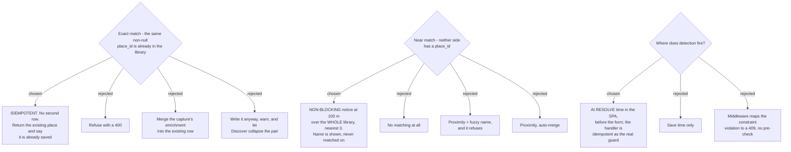

# ADR-149: An exact `place_id` duplicate is **idempotent**, and a `place_id`-less **near** match only **warns**

**Date:** 2026-08-07
**Status:** Accepted
**Relates to:** issue #48; decision-map `discover-add-place-48` (#53), ticket `duplicate-policy` (#61). Builds on **ADR-147** (the `SavedPlace` home and its `GooglePlaceId ?? sp:/tp:` collapse) and **ADR-148** (the dedupe-only `TripPlace.SavedPlaceId`, which removed the self-inflicted fork and narrowed this ticket to genuine matching). Consumes the two-different-ids measurement in `plus-code-resolution` (#57). Honours **ADR-145** (backend messages stay English). **Corrects** the duplicate-behaviour claim written into `AddPlaceMode.tsx:45` and `:117`. Unblocks `capture-mock` (#62). Adds no CONTEXT.md term.

## Context

The ticket's premise was that `AddTripPlaceHandler` "does not dedupe on `(TripId, GooglePlaceId)`", so a re-capture leaves a duplicate row. **Measured on `main` (`7411bf2`) with three throwaway relational tests against `SqliteAppDbContext`, all passing, then deleted:**

| Probe | Result |
|---|---|
| Same `place_id` twice in **one trip** | **Throws `DbUpdateException`** |
| Two **null**-`place_id` rows in one trip | Saves fine, 2 rows |
| Same `place_id` across **two trips** | Saves fine |

The cause is `TripPlaceConfiguration:77-79` — `HasIndex(TripId, GooglePlaceId).IsUnique().HasFilter("[GooglePlaceId] IS NOT NULL")` — shipped as `IX_TripPlaces_TripId_GooglePlaceId` in `TripsInitial` (`20260629104508`), i.e. from the very first Trips migration. `ExceptionHandlingMiddleware` classifies `ValidationException`, `DomainException` and `UnauthorizedAccessException` and nothing else (`:101-120`), so the violation falls through to the generic handler.

**So the premise is true of the handler and false about the outcome: the database already refuses that duplicate, and the user gets HTTP 500 "An unexpected error occurred."** The same wrong claim is written into the SPA twice — `AddPlaceMode.tsx:45` ("`AddTripPlaceHandler` does not dedupe on `(TripId, GooglePlaceId)`") and `:117` ("re-creating here would leave a duplicate library Place on every retry"). It would not leave a duplicate; it would crash. The `createdRef` idempotency guard those comments justify is still correct behaviour — it is guarding against a 500, not against a duplicate — but its stated reason is wrong.

Three further facts shaped the answers:

**There is no delete surface for a Saved place.** Place CRUD from Discover is explicitly out of scope on this map (#50 closed it out). A wrong *merge* is therefore unrecoverable from Discover, which rules out any policy that guesses and then destroys.

**The client already holds every candidate.** `ListMyPlacesHandler` returns the user's whole library unpaged, and `frontend/src/pages/discover/lib/distance.ts` already exports `haversineKm`, used by `discoverFilter.ts:63` for the Discovery distance signal. A proximity scan is therefore a pure function over data already in memory — no new endpoint, no new index, and it lands in `lib/`, which is where this repo actually has vitest coverage (`discoverFilter.test.ts`).

**ADR-145 keeps backend messages English.** Any policy whose normal path is a server *refusal* shows English text to a Thai-UI user on a routine action.

## Decision

### 1. An exact `place_id` match is idempotent, never a second row

- **Detection fires at resolve time**, the moment a `place_id` is in hand (URL resolved, POI tapped, suggestion picked) and **before the capture form renders**. The form opens in an "already saved" state, so the user never types a category or review links that would have to be discarded.
- **The handler is idempotent too.** It pre-checks and **returns the existing row** instead of inserting. One policy covers the SPA, MCP and a race — not two policies that can disagree.
- **Nothing is merged.** The capture's enrichment is not written onto the existing place; a capture is not an edit, and the user did not ask for one.
- **No English error reaches the user on this path.** The SPA words it in Thai and offers to open the existing place.

### 2. A `place_id`-less near match warns and never blocks

- At resolve time the SPA scans **the whole library** — `place_id`-bearing and `place_id`-less alike — for the user's places within **100 m** of the new coordinates, and shows the **nearest 3** in a **non-blocking** notice. The user may proceed or abandon.
- **The name is shown so the user can judge; it does not participate in the predicate.** No fuzzy matching over freeform Thai names.
- Scanning the whole library is what catches the case nothing else can see: the same physical place saved once from a URL (a `ChIJ…` id) and once from coordinates or a Plus Code (no id) — #57 measured that these two never share an identifier.
- Because it only warns, a false positive costs a glance and leaves nothing to undo — the only safe shape given there is no delete surface.

### 3. `SavedPlace` gets the same filtered unique index

`SavedPlace` gains a unique `(UserId, GooglePlaceId)` index filtered on `GooglePlaceId IS NOT NULL`, mirroring `TripPlace`'s. It is free to add now precisely because the entity is not built yet (ADR-148), and it is the integrity backstop **under** the idempotent handler rather than the policy itself. `place_id`-less rows are excluded by the filter, so two coordinate captures remain two rows — deliberately, per section 2.

### 4. What this fixes, and what it leaves alone

| Case | Behaviour after this ADR |
|---|---|
| Same `place_id`, same trip | **No longer a 500.** Idempotent: the existing row is returned |
| Same `place_id`, two trips | Unchanged — 2 rows, 1 Discover card. Legitimate: the place is on both itineraries |
| Discover capture of a `place_id` already on a `TripPlace` | Idempotent — the existing place is returned, no `SavedPlace` written |
| Discover capture of a `place_id` already a `SavedPlace` | Idempotent, and now index-enforced |
| Two coordinate captures of one spot | **2 rows, 2 cards, with a 100 m notice shown before the second.** Still the user's call |
| Coordinate capture near a URL-captured place | The same 100 m notice. The only mechanism that sees this pair |

A second **Stop** at the same place never needed a second `TripPlace` — a `Stop` references `TripPlaceId` and one `TripPlace` may carry many Stops — so lunch and dinner at the same mall is unaffected by any of this.

## Rejected

**Exact match — refuse with a 400 (B1).** The smallest change, and it matches how every other domain rule in this codebase behaves: `throw new DomainException(...)`, which the middleware already maps to a 400 `ProblemDetails` the SPA renders. Rejected because ADR-145 keeps that message English, so a Thai-UI user meets English text on a routine action — and because a refusal discards the category and review links the user typed, for a place that is *already in their library*. That is a wall rather than an answer.

**Exact match — merge the enrichment (C1).** Nothing the user typed is lost, and it produces the one card their mental model expects. Rejected because it silently mutates a place the user did not open for editing. With no delete surface and no undo, a capture that quietly overwrites an existing note or review-link set is a write nobody asked for.

**Exact match — allow it through with a warning (D1).** Discover's `GooglePlaceId` collapse (ADR-147) would hide the pair anyway, so the user would never see two cards. Rejected because it requires **dropping or relaxing `IX_TripPlaces_TripId_GooglePlaceId`** — a migration that removes an integrity guarantee held since the first Trips migration — in order to permit rows that exist only to be hidden by a read model.

**Near match — no matching at all (B2).** Zero query, zero threshold to defend, zero false positives, and ADR-147 already declared this gap "known and accepted", so this decision would merely ratify it. Genuinely tempting. Rejected because the ticket exists to close exactly this and the fix turned out cheap: the candidates are already in memory and `haversineKm` is already written and tested. A user who captures one viewpoint twice would otherwise get two identical cards with no hint why.

**Near match — proximity plus name, and it refuses (C2).** The strongest dedupe, and it would guarantee one card per physical place. Rejected on two counts: it needs a fuzzy-match rule for freeform Thai names, which is a matching problem of its own; and a false positive **refuses a genuinely different place** — two stalls twenty metres apart in one market — with no delete surface to recover through.

**Near match — proximity auto-merge (D2).** One card guaranteed, with no decision asked of the user. Rejected as the worst combination available here: the match is a guess, and merging on a guess with no undo and no delete surface destroys data the user cannot get back.

**Detection — save time only (B3).** One code path, server-side, identical for SPA and MCP, no new client logic. Rejected because by submit time the user has already picked a category and typed review links, so a short-circuit throws that work away and forces a separate decision about what happens to it. Checking at resolve time makes that question disappear rather than answering it.

**Detection — only map `DbUpdateException` to a 409 (C3).** One catch block in the middleware, no query anywhere, and today's 500 stops being a 500. Rejected because it leaves the policy living in a database index instead of the domain: the API's contract for a duplicate becomes "whatever the constraint happens to be", MCP gets a 409 to interpret, and the `place_id`-less half of the question — the actual hard part — goes unanswered.

## Consequences

**Two stale comments must be corrected in the same change.** `AddPlaceMode.tsx:45` and `:117` state a duplicate outcome the database has never permitted. Left as they are, they will justify the wrong fix the next time someone touches that retry path.

**`ExceptionHandlingMiddleware` still has no `DbUpdateException` arm, and that is now deliberate.** With the handler idempotent, a unique-constraint violation means a genuine race, which is a real 500. Classifying it would hide the race behind a friendly message.

**The proximity scan belongs in `frontend/src/pages/discover/lib/`, as a pure function.** The SPA has no component or visual test harness, so that is the only way any of it gets automated coverage — and `discoverFilter.test.ts` proves the module is testable. The **notice itself** is render-level: nothing automated will catch it rendering wrong, blocking when it should not, or covering the map. Verify interactively before pushing (learned on #36).

**100 m is a judgement, not a measurement.** It is chosen against the realistic drift between coordinates pasted from a chat and the same spot tapped on a map (50–80 m), and against a library of tens of places rather than thousands. If the notice starts firing on unrelated places, the threshold is the thing to move — it is a constant in a pure function, not a schema decision.

**`SavedPlace`'s unique index rides the ADR-147/148 migration** rather than adding one of its own. Migrations here are applied to prod **by hand**; #49 caused a Discover-wide outage by skipping that step.

**The idempotent handler needs a way to tell a caller "this already existed".** The SPA does not need it (it checked at resolve time), but an MCP caller does. The exact response shape is `mcp-surface` (#63)'s to settle; this ADR fixes only that the existing row is returned rather than a second one written.

**`capture-mock` (#62) must now draw two states it did not have before:** the "already saved" form state, and the non-blocking near-match notice with up to three named neighbours and their distances.
