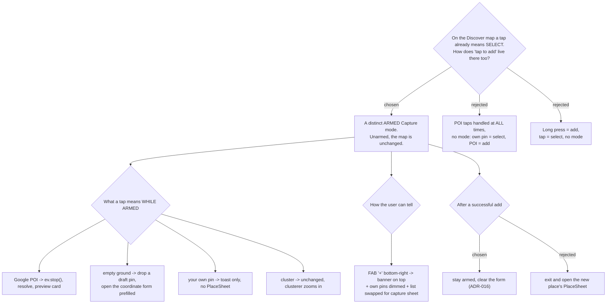

# ADR-150: Discover capture is a distinct **armed Capture mode** — POI taps only while armed, an empty tap becomes the coordinate input

**Date:** 2026-08-08
**Status:** Accepted
**Relates to:** issue #48; decision-map `discover-add-place-48` (#53), ticket `map-tap-conflict` (#59). Follows the Trips precedent in ADR-016 (add-place is an armed, map-centric mode). Builds on ADR-147 (**Saved place**), ADR-148 (a coordinate place is **user-named**), ADR-149 (duplicate policy). Prices the tap against ticket `geocoding-cost` (#58) and ADR-122 (Discover's hourly strip calls live on selection). Unblocks `capture-mock` (#62); deliberately does **not** decide `shared-capture` (#60). Introduces the CONTEXT.md term **Capture mode**.

## Context

Measured on `main` (d251edd):

**Discover's map has no ground handler at all.** `DiscoverMap.tsx` attaches `gmp-click`
only to the user's own `AdvancedMarkerElement`s (`:55`) → `onSelect(p.key)` →
`setSelectedKey` → `PlaceSheet` replaces `PlaceBottomSheet` (`DiscoverPage.tsx:105-115`).
`<Map>` carries **no** `onClick`, so a Google-POI tap and an empty-ground tap do nothing
today. The conflict named by #59 is therefore not a live collision — it is the collision
that *appears* the moment adding becomes possible.

**Trips already solved the same problem, modally.** `TripMap.tsx`'s `onClick` returns
immediately `if (!addMode)` (`:181`); a POI tap carries `ev.detail.placeId`, calls
`ev.stop()` to suppress Google's own info window, and hands the id to `AddPlaceMode`
(`:186-190`). Empty-ground taps are ignored, and ADR-016 filed reverse-geocoding them as
an explicitly rejected Phase 2 item. The mode is armed by a `+ เพิ่มสถานที่` button that
flips to `เสร็จ` and stays armed after each add.

Three facts about Discover specifically shaped the answer:

**Discover clusters; Trips does not.** `MarkerClusterer` (`DiscoverMap.tsx:58`) means that
at low zoom a tap already hits a *cluster*, not a place — "a tap means select" was never
universally true on this surface.

**Selecting a place is not free.** `PlaceSheet` mounts `DiscoverHourly`, which fires
`useGetHourlyForecastQuery` on mount (`DiscoverHourly.tsx:32`, ADR-122). Every selection is
a live billed Weather call, so letting an armed own-pin tap open the sheet spends money on
a place the user was not inspecting.

**The tap is one of four inputs, not the surface.** #48 requires URL, tap, lat/lng and Plus
Code. The other three need a typed form regardless, so the tap can only be designed as the
*fastest path into* a capture surface that has to exist anyway.

**Discover has no add affordance whatsoever.** Its topbar is title + `FilterBar` only, so
any answer here also has to introduce the entry point.

## Decision

1. **Capture on Discover is a distinct armed mode**, mirroring ADR-016 rather than inventing
   a second interaction grammar. Unarmed, the Discover map behaves exactly as it does today:
   a tap on your own pin selects and opens `PlaceSheet`; POI and ground taps do nothing.
2. **While armed, every tap belongs to capture** — one rule, no per-target ambiguity:
   - **A Google POI tap** calls `ev.stop()` and resolves the `place_id` into the preview
     card, exactly as `AddPlaceMode` does.
   - **An empty-ground tap drops a draft pin and opens the coordinate form prefilled** with
     that lat/lng, editable, with the name typed by the user per ADR-148. No Geocoding call
     is made ($0). This is the one place Discover deliberately departs from ADR-016, which
     ignored ground taps — coordinates were not a required input then, and are now.
   - **A tap on your own pin warns and nothing else** — a `มีอยู่ในคลังแล้ว` toast, no
     `PlaceSheet`, no Weather call. This is ADR-149's duplicate policy expressed in the UI
     *before* a call is spent rather than after.
   - **A cluster tap is unchanged**; the clusterer zooms in, armed or not.
3. **The mode is signalled three ways at once**: a banner strip across the top of the map
   (the `.add-capture-banner` treatment Trips already ships), the user's own pins **dimmed**,
   and `PlaceBottomSheet` swapped for the capture sheet holding all four inputs. The banner
   is a thin strip, never a fill — issue #36 shipped a capture banner that covered the whole
   Discover map and read as a black screen. Armed from a `+` FAB above the bottom sheet;
   exited by the banner's `‹`, or `Esc`.
4. **An accidental tap can never write.** Its full cost is: POI → one Places Details call
   ($20/1k ENTERPRISE per #58) and a card to dismiss; empty ground → $0 and a form to
   dismiss; own pin → $0 and a toast. Saving is always a separate, explicit confirm.
5. **After a successful add the mode stays armed** and the form clears (ADR-016). The new
   Saved place immediately renders as one more dimmed own-pin, which doubles as the
   confirmation that it landed.

**Rejected: POI taps handled at all times.** No mode to arm is genuinely cheaper for the
user, but on a dense Bangkok map with `gestureHandling="greedy"` (one-finger pan), a sloppy
pan lands on a POI constantly — and each of those is a billed Details call plus a card
covering the map, for a user who was only browsing.

**Rejected: long press.** No precedent anywhere in the repo, undiscoverable without a hint,
and the Maps JS SDK has no long-press event — it would mean hand-rolling a pointer timer
that fights `greedy` pan and pinch.

**Rejected: letting an armed own-pin tap still open `PlaceSheet`.** It keeps the two
meanings living side by side, which is the ambiguity #59 exists to remove, and it spends a
Weather call per misfire.

**Rejected: exiting the mode after one add.** Discover is where a user sweeps up several
places at once; re-arming per place is the wrong default for that surface.

## Consequences

- Discover gains its first mode. `discoverSlice` gains the armed flag; `DiscoverMap` gains
  an `onClick` on `<Map>` gated on it, plus a dimmed-pin variant of `pinElement`.
- The four inputs need one surface to live in — that is `capture-mock` (#62), which this
  decision unblocks and constrains: the mock must show both the unarmed and armed states.
- Whether this armed mode becomes a component **shared** with `AddPlaceMode` or a Discover
  sibling of it is **not** decided here; that is ticket `shared-capture` (#60). This ADR
  fixes the *semantics* the shared thing must honour, not its factoring.
- The SPA has no visual test harness and the review gates are blind to fidelity (CLAUDE.md),
  so the dimmed-pin state, the banner's footprint and the draft pin must be verified
  interactively against the #62 mock before this ships.
