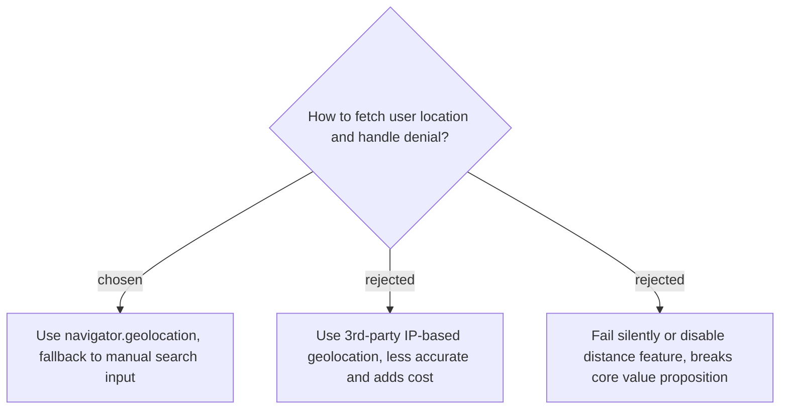

# Location Fetching and Fallback

We will use the standard HTML5 `navigator.geolocation` API to fetch the user's current location, as it provides the most accurate GPS coordinates required for distance calculation. If the user denies permission, the UI will display a warning and a manual search input to let them specify their starting point, ensuring the distance calculation feature can still function.
