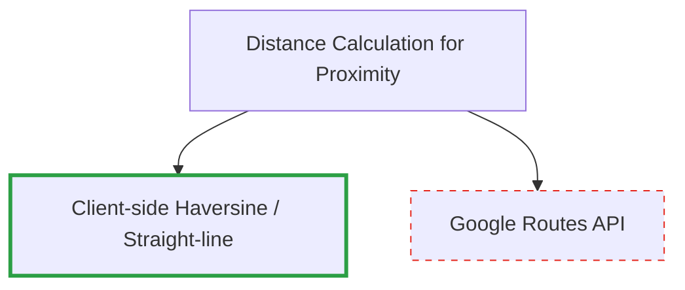

# 152. Distance Calculation via Client-side Haversine

Date: 2026-08-08

## Status

Accepted

## Context

For the "Proximity Threshold" feature (checking if the user has arrived at the next stop), we need a way to calculate the distance from the user's live location to the target location. We already use the Google Routes API for `Leg` and `Approach leg` travel times. The question is whether to reuse the Google Routes API for this proximity check or use a simpler client-side calculation.

## Decision

We will use the **Straight-line (Haversine)** formula calculated on the client-side (e.g., using Turf.js or a custom Haversine function).

## Consequences

- **Cost Savings:** Avoids hitting the Google Routes API repeatedly as the user's location updates, which would incur significant costs.
- **Performance:** Client-side calculation is instantaneous and works perfectly offline or with poor connectivity.
- **Accuracy Trade-off:** Straight-line distance is not the actual driving/walking distance. However, for a proximity trigger (e.g., "within 100 meters of the destination"), straight-line distance is perfectly adequate.
