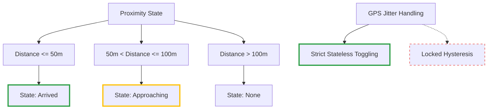

# 153. Proximity Thresholds and Strict Toggling

Date: 2026-08-08

## Status

Accepted

## Context

We need to define the exact thresholds for when a user is considered to be "Approaching" (กำลังเข้าใกล้) and "Arrived" (ถึงจุดหมาย) at a `Stop`. Since we previously decided to use a client-side Haversine (straight-line) distance calculation (ADR 152), these thresholds are evaluated against that straight-line distance in meters. We also need to decide how to handle GPS jitter around the boundary lines.

## Decision

1. **Arrived Threshold:** <= 50 meters straight-line distance.
2. **Approaching Threshold:** <= 100 meters straight-line distance (and > 50 meters).
3. **Jitter Handling:** We use **strict stateless toggling**. The app will simply reflect the state of the *current* GPS reading. If the reading bounces back and forth across the 50m boundary, the state will toggle between "Arrived" and "Approaching" without any artificial locking or hysteresis.

## Consequences

- **Simplicity:** The logic is a pure function of the current location state, requiring no previous state memory (stateless).
- **Predictability:** The user always sees exactly what the raw data is reporting.
- **Flickering:** In areas with poor GPS accuracy, the UI may flicker rapidly if the user is standing right on the 50m or 100m boundary. This is deemed an acceptable trade-off for architectural simplicity.
