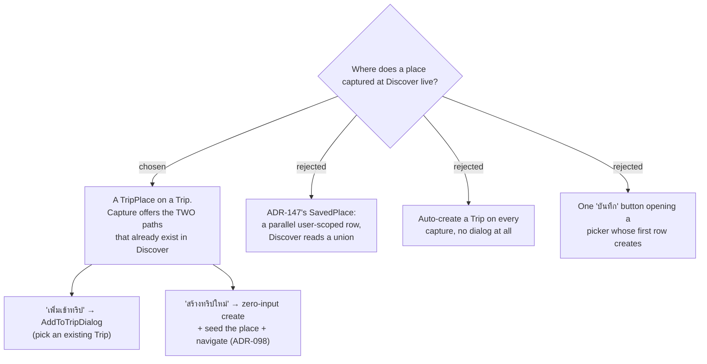

# ADR-155: A Discover capture must attach to a **Trip** — `SavedPlace` is not built

**Date:** 2026-08-11
**Status:** Accepted
**Relates to:** issue #48; decision-map `discover-add-place-48` (#53), ticket `place-home` (#54), reopened and re-decided. **Supersedes ADR-147** in full. **Partially voids ADR-148** (its dedupe-only `SavedPlaceId` mechanism only — see below). Terminology-only impact on ADR-149 and ADR-150, whose decisions stand. Builds on ADR-098 (creating a Trip from a discovered Place seeds it as the Trip's first `TripPlace`). **Deletes** the CONTEXT.md definition of **Saved place** and re-amends **Capture**, **Capture mode**, **Place** and **Discover**. Re-opens for re-answer: `coordinate-places` (#55), `duplicate-policy` (#61); re-scopes `trip-less-place-rendering` (#64) and `stop-picker-saved-places` (#66); unblocks `shared-capture` (#60), `mcp-surface` (#63), `capture-mock` (#62).

## Context

ADR-147 chose a new user-scoped `SavedPlace` entity, read by Discover as a union with
`TripPlace`. It weighed five options and **rejected option E — "force the user to pick or create a
trip, so nothing trip-less ever exists"** — on this reasoning (ADR-147:101-105):

> Rejected because it re-opens the precise gap Discover was built to close: CONTEXT.md says
> Discover "closes the gap that Places are otherwise reachable only inside one Trip", and demanding
> a trip at capture time puts that gap back at the moment of capture.

Reviewing the capture user-journey step by step, the owner reversed that: a captured place **must**
be tied to a Trip.

> "ให้สร้างทริป ต้องผูกกับทริป"

The friction this ADR's predecessor implicitly priced in — `CreateTripCommand` requires `Name`,
`StartDate`, `DayCount` and `DefaultTravelMode` (`CreateTripCommand.cs:6-7`) — was raised against
the reversal, and the owner reaffirmed it: *"บังคับจริง — กลับคำ #54"*.

**The decisive fact ADR-147 did not weigh: both attach paths already exist, fully wired, in
Discover today.** Option E was rejected as if it cost a form. It costs one tap.

- **`DiscoverPage.handleCreateTrip`** (`DiscoverPage.tsx:55-82`, ADR-098) creates a Trip from a
  place with **zero user input** — `name` = the place's name, `startDate` = today, `dayCount` = 1,
  `defaultTravelMode` = `Drive` — then seeds that place as the Trip's first `TripPlace` and
  navigates to the trip.
- **`AddToTripDialog`** (`AddToTripDialog.tsx`) lists the user's Trips; one tap adds the place.
  Both are already rendered side by side on `PlaceSheet` for a place that is already in the library.

Two further facts narrowed the shape:

- **`TripPlace.Create` requires only `tripId, name, lat, lng, category`** (`TripPlace.cs:39-48`) —
  **no `ItineraryDay`**. A captured place therefore rests in the Trip's *pool* without being
  scheduled, which is exactly the semantics a capture wants.
- **Deleting a Trip is a soft delete** (`DeleteTripHandler.cs:22` → `trip.SoftDelete()`), and
  `ListMyPlacesHandler` gates its join on `t.DeletedAt == null` (`:27`). The row is never
  destroyed; it stops being projected.

## Decision

- **A Discover capture writes a `TripPlace`.** No new entity, no `DbSet<>` on the three
  `IApplicationDbContext` implementers, no EF configuration, **no migration**.
- **`ListMyPlacesHandler` is untouched.** It stays the single query it is today: one join, the
  `t.DeletedAt == null` gate intact, `GooglePlaceId ?? "tp:{id}"` as the only dedupe key, and the
  `rows.Count == 0` early return (`:31`) still correct because there is no second source.
- **The capture preview sheet offers the two paths as two same-level buttons**, mirroring
  `PlaceSheet` as it stands today rather than inventing a surface:
  **"เพิ่มเข้าทริป"** opens `AddToTripDialog` to pick an existing Trip, and
  **"สร้างทริปใหม่"** runs the zero-input create-and-seed of ADR-098.
  A consequence worth naming: `AddToTripDialog`'s empty state already reads
  *"ยังไม่มีทริป — ใช้ 'สร้างทริปใหม่' แทน"*, which is a dead end today because no such button is
  reachable from that dialog. With both buttons on the sheet behind it, that copy becomes correct.
- **`trips[]` is never empty.** Every place in Discover sits on at least one live Trip, restoring
  the invariant `PlaceSheet.tsx:22-24` documents (*"0 shouldn't happen — a discovered place always
  comes from a TripPlace"*) and which ADR-147 had invalidated.
- **A place is lost from Discover when its Trip is soft-deleted. Accepted.** This is already what
  happens to every trip-captured place — ADR-147:140-144 states it plainly — so the reversal does
  not create an exposure; it removes the asymmetry ADR-147 introduced, where a Discover-captured
  place survived and a trip-captured one did not. The underlying row is not destroyed.
- **The trip picker must be fixed before capture ships.** `AddToTripDialog` calls
  `useListTripsQuery()` with no arguments, so the request carries no query parameters and
  `ListTripsHandler` applies its defaults: `Take = 10` (`:39`) ordered by `StartDate` **ascending**
  (`:33`). The dialog therefore shows **only the ten oldest-starting Trips**, with no search and no
  paging. Under this decision the picker is the **mandatory gate for every capture**, so a user
  whose target Trip is not among those ten cannot capture into it at all. Required: pass
  `take: 100` and `sortColumn: 'startDate', sortDirection: 'Descending'`, and add a search box
  bound to the `search` parameter `ListTripsHandler:20-25` already implements. No backend change.

### What this voids

- **`SavedPlace`** — the entity, its nullable `GooglePlaceId`, its EF configuration and its
  migration. With the migration goes ADR-147's largest operational risk: a hand-applied prod
  migration whose omission would have produced `Invalid object name 'SavedPlaces'` across all of
  Discover (the #49 outage mode).
- **The union read** in `ListMyPlaces`, the `sp:` / `tp:` dual dedupe keys, and the rework of its
  `rows.Count == 0` early return.
- **ADR-147's survival guarantee** — deliberately, per the decision above.
- **ADR-148's dedupe-only `TripPlace.SavedPlaceId`**, which has nothing left to point at. Its two
  other findings survive in substance: a coordinate capture is still **user-named**, and a
  `place_id`-less place still carries its **Place note**, **Review link**s, **Best-time window**s
  and **Season period**s **on its own `TripPlace` row** — `ListMyPlacesHandler:62-65` already falls
  back to the representative `TripPlace` when no `PlaceProfile` master exists. What is now open is
  how one physical coordinate place keeps **one** identity across two Trips; that is
  `coordinate-places` (#55) and `duplicate-policy` (#61) to re-answer, not this ADR.

### Rejected

- **Keep ADR-147's `SavedPlace` (B)** — it is the cleaner conceptual answer, it is the only option
  that lets a place outlive every Trip it was ever on, and it had already been accepted and
  documented. Rejected because the owner reversed it on an explicit re-reading of the capture
  journey, having been shown the cost, and because the reasoning that rejected option E turns out
  to have over-priced it: the "gap at the moment of capture" is one tap on a button that is already
  on screen, not a form.
- **Auto-create a Trip on every capture, no dialog (C)** — the least friction of all, and it needs
  no picker at all. Rejected because it makes the Trips list the dumping ground: capturing twenty
  cafés yields twenty one-day Trips named after cafés, and the user loses the ability to say "this
  one belongs to the Japan trip" at the only moment they are thinking about it. It also reproduces
  the leak that sank ADR-147's option D — a Trip the user never meant to plan showing up as a
  `trips[]` chip on the very card it exists to serve.
- **One "บันทึก" button opening a picker whose first row is "+ สร้างทริปใหม่" (D)** — one decision
  point instead of two, and it would have fixed `AddToTripDialog`'s dead-end empty state directly.
  Rejected by the owner in favour of mirroring the `PlaceSheet` that already exists, which adds no
  new UI and keeps the two Discover surfaces identical.

## Consequences

**Zero schema change and zero migration.** Nothing has to be applied to prod by hand, and the
map's migration/backfill fog line dissolves rather than being answered.

**Capture grows the Trips list.** Every capture either touches an existing Trip or creates one. The
"สร้างทริปใหม่" path is one tap and produces a one-day Trip named after the place, so a user who
never picks an existing Trip accumulates one Trip per captured place. This is the accepted cost of
the reversal and the reason option C was rejected rather than adopted — the picker is what keeps it
in check, which is why fixing the picker is a prerequisite and not a follow-up.

**`trip-less-place-rendering` (#64) shrinks.** Its question as charted — what Discover shows for a
place with **no Trip** — has no subject any more. What remains is a place with **no `place_id`**,
and three of the four Discovery signals plus the category filter already degrade correctly with
**zero** edits (measured on `main` at 722bef6): `category` is non-nullable `PlaceCategory`
(`api.ts:545`); `discoverFilter.ts:80` drops only `openNow === false` while `isOpenAt(null)`
returns `null`; `:81` drops only `'bad'` while `monthStatus([])` returns `'none'`; and `:90`'s
best-time is a **sort tiebreak, not a filter**. `DiscoverHourly` needs neither a Trip nor a
`place_id` — it queries by lat/lng (`DiscoverHourly.tsx:32`).

**`PlaceSheet.tsx:68`'s `disabled={place.trips.length === 0}` becomes unreachable.** It is now dead
defence rather than a live guard, and the "เปิดทริป" button can no longer render permanently
disabled.

**`stop-picker-saved-places` (#66) needs re-scoping, not answering.** Its question — does the Trips
picker list trip-less **Saved places** — presupposes a category of place that will not exist.

**CONTEXT.md loses a term.** **Saved place** is deleted outright; **Capture**, **Capture mode**,
**Place** and **Discover** drop their references to it. The glossary returns to having no word for
a place outside a Trip — which, per ADR-147's own Context section, is what the language always
said.

Frontend only, plus the picker parameters. No domain, application or persistence change.
